# Hexen Sharp

[](https://github.com/adamfoxdev/classic_doom_clone_cheap_pc/actions/workflows/tests.yml)

A small Hexen-style first-person shooter written in C#, set on a derelict space station. The original
dark-fantasy look is kept as an option (**Options → Visual style**). It's built to run on cheap PCs: everything is
software-rendered into a 320×200 framebuffer, and all textures, sprites and sounds are generated in code.
There are no asset files, except for an optional pack of Blender-rendered sci-fi art (**Options → Rendered art**,
see [Rendered art pack](#rendered-art-pack-blender)).

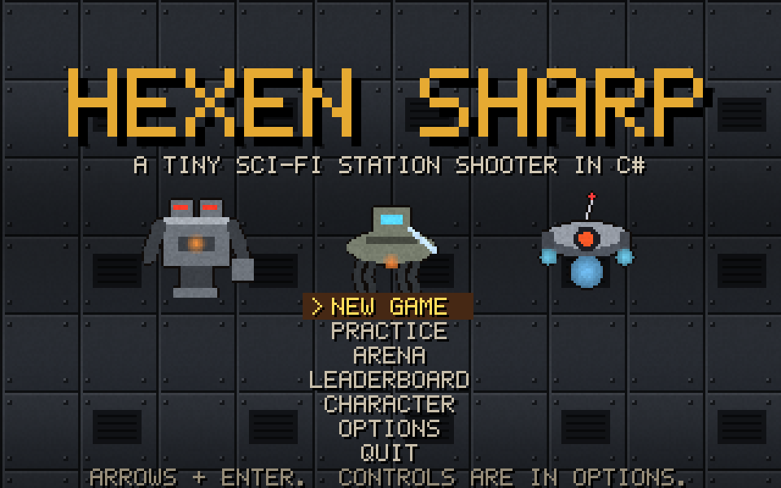
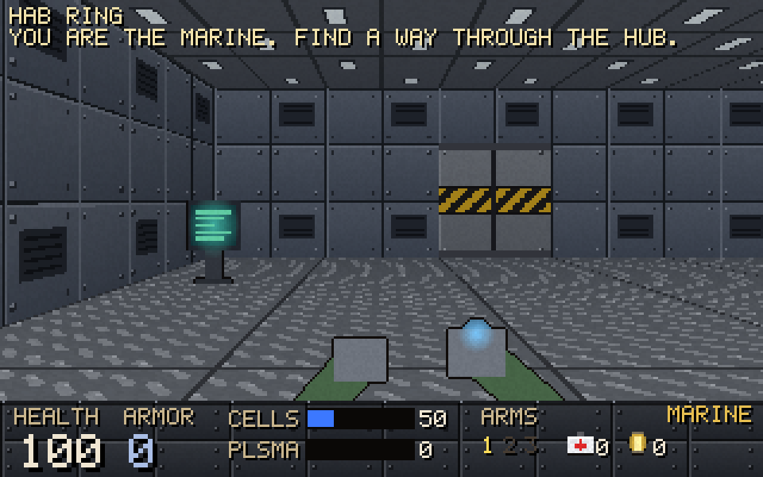
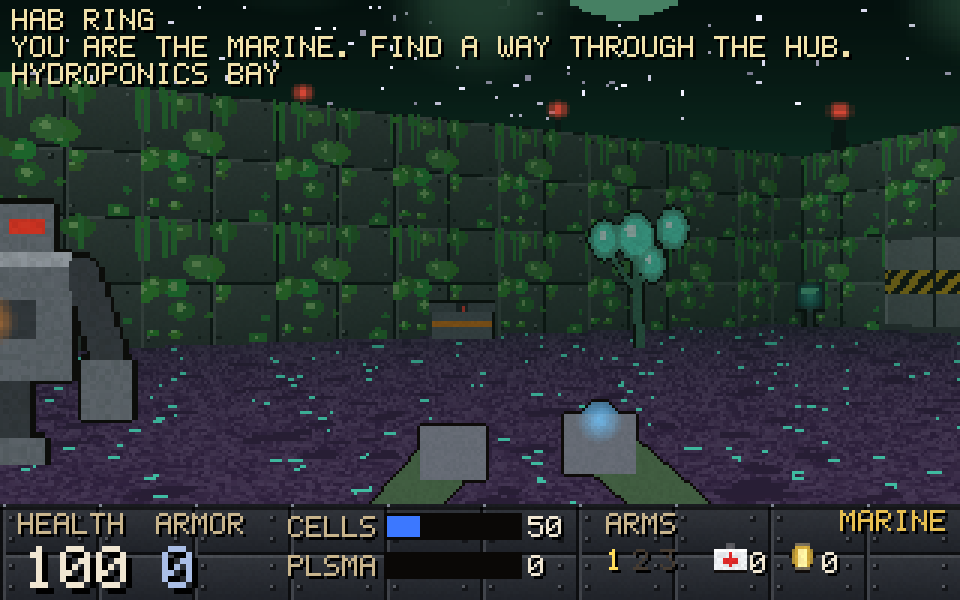
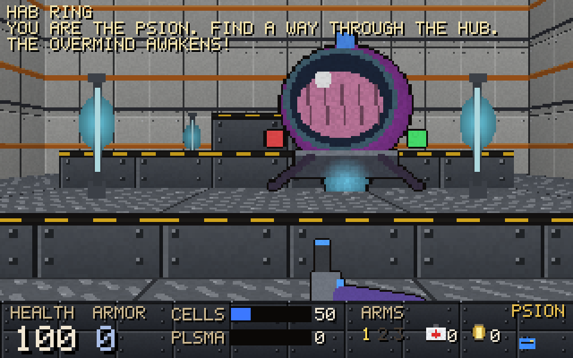
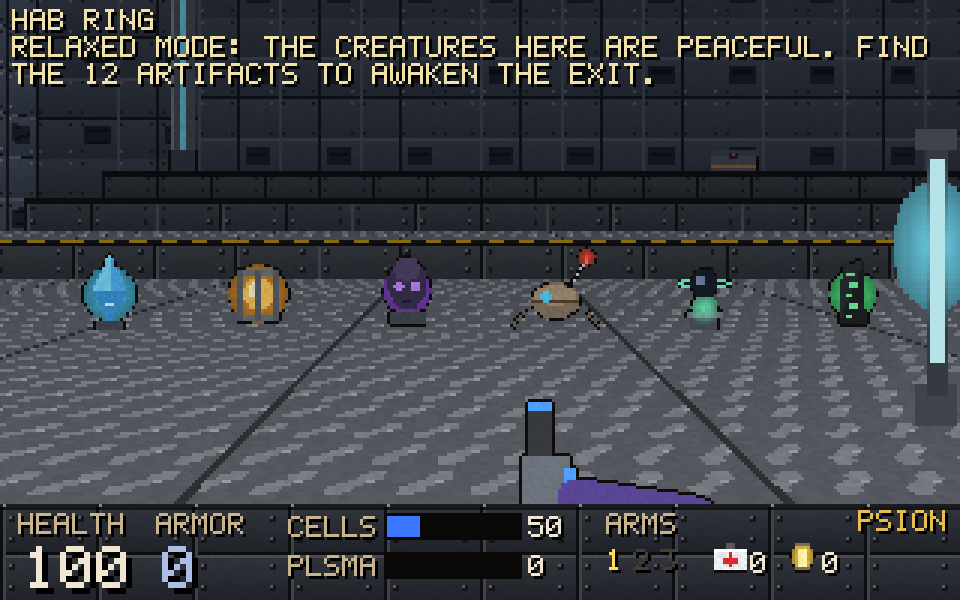
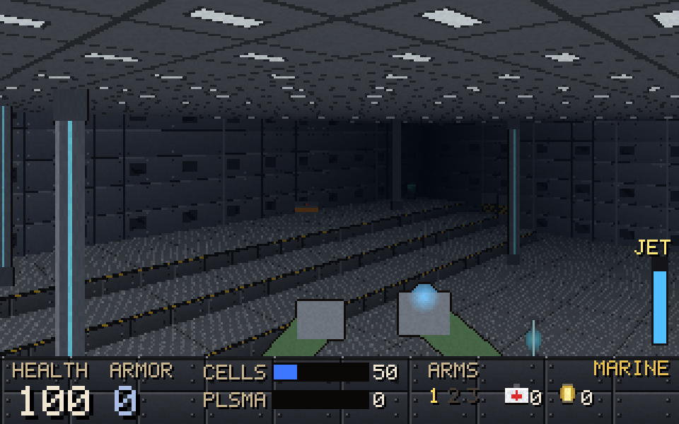
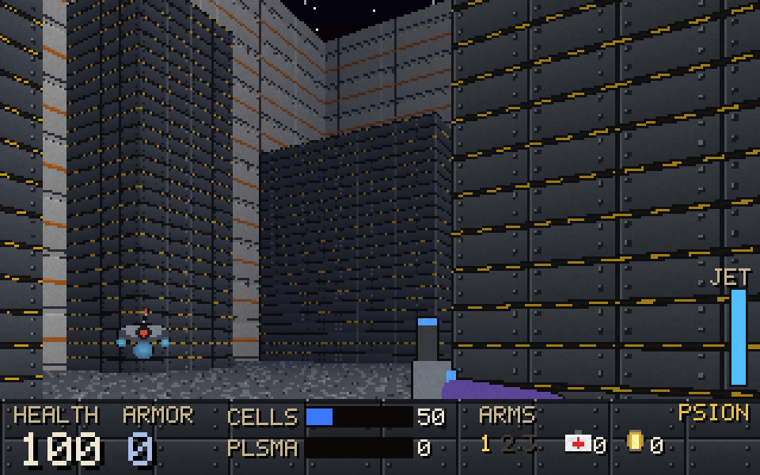
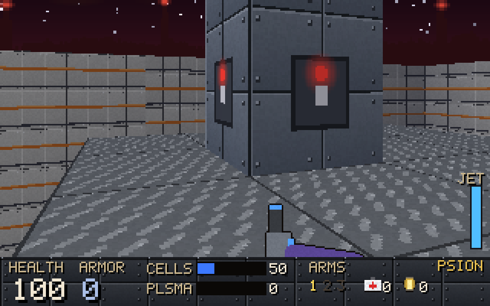
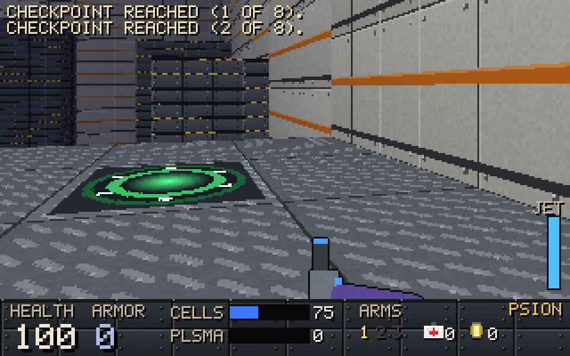

<details>
<summary>More screenshots, including the original fantasy style</summary>


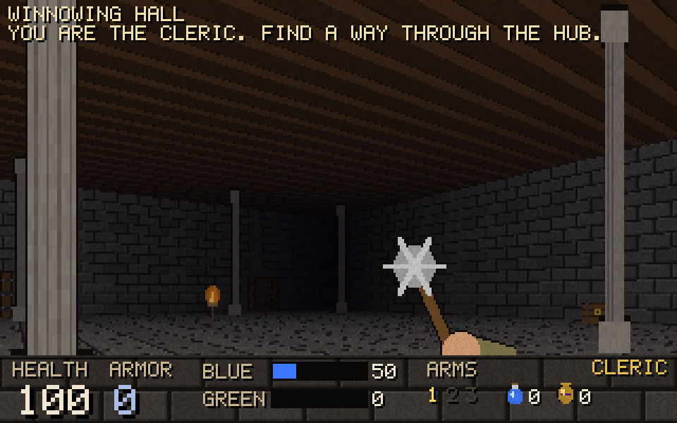
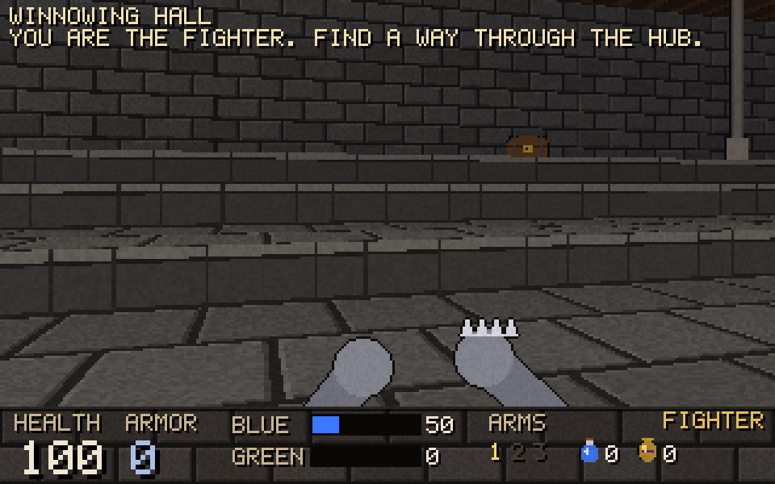
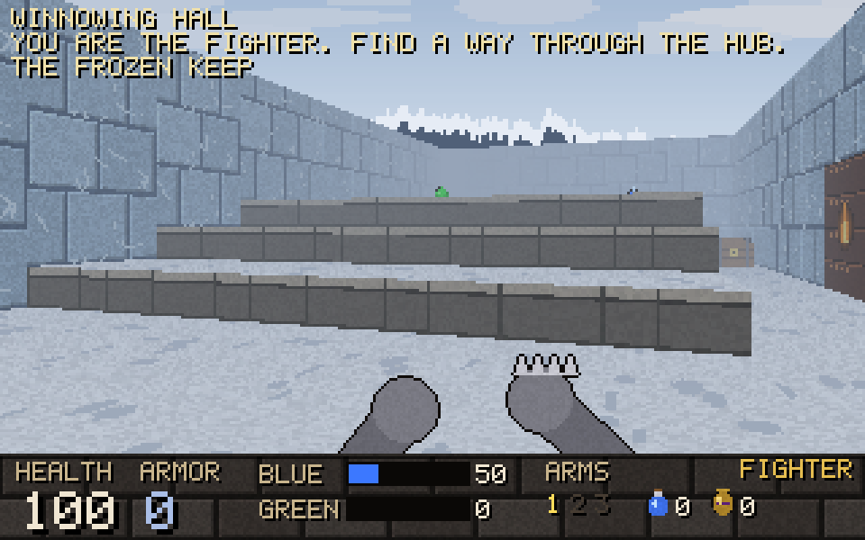

</details>

## Features

- **Two visual styles:** a **sci-fi** space station (the default) and the original **dark-fantasy** look.
  Switch any time, even mid-game, from Options or with `artstyle scifi|fantasy` in the console; the choice is
  saved. Each has its own textures, skies, monsters, items, first-person weapons, names and lore; the maps and
  gameplay are identical. In sci-fi, the Fighter, Cleric and Mage become the Marine, Engineer and Psion; Ettins
  become brute mechs, Afrits drones, Centaurs striders, Dark Bishops psi wraiths and the Heresiarch the Overmind;
  mana becomes energy and plasma cells, keys become keycards, and portcullises become force fields. Relaxed
  mode's relics become **alien artifacts** in six designs: data crystals, caged quantum cores, xeno idols,
  ancient probes, gravity pearls and monolith shards.

- **Two play styles**, chosen when you start a new game:
  - **Classic:** fight through the hub, solve its puzzles and slay the Heresiarch.
  - **Relaxed:** no combat. Creatures wander peacefully and shy away if you get close, your weapon stays
    sheathed, and you can't die. Instead you explore: find the **12 relics** hidden across the hub (placed
    differently every game, favouring dead ends and far corners), read **lore stones**, and uncover **secret
    passages**. The HUD tracks relics, lore, secrets and how much of the hub you've explored. Finding every
    relic awakens the exit portal. Keys, levers, block puzzles and chests all still work, and chests are never
    traps.

- **Three classes**, each with their own three weapons, like Hexen:
  | Class | 1 (no mana) | 2 (blue mana) | 3 (green mana) |
  |---|---|---|---|
  | Fighter | Spiked Gauntlets | Timon's Axe | Hammer of Retribution |
  | Cleric | Mace of Contrition | Serpent Staff | Firestorm |
  | Mage | Sapphire Wand | Frost Shards | Arc of Death |
- **Blue and green mana.** The Fighter's axe still works without mana, just weaker.
- **Hub levels.** Portals connect *Winnowing Hall*, *The Frozen Keep*, *Darkmere Crypt*, the *Windspire* and
  the optional *Hanging Cisterns*, *Deepdelve Quarry*, *Bedrock Depths*, *Barren World*, *Void Crossing* and *Verdant Moon*. Each map keeps its state (dead monsters, opened doors, pulled levers, smashed rubble) when you leave and come back.
- **Puzzles.** Levers raise portcullises, the Fire Key and Steel Key open locked doors in other maps, and the
  exit stays sealed until the Heresiarch is dead. **Pushable stone blocks** go onto **pressure plates**: `E`
  pushes a block one cell, `Shift+E` pulls it toward you, so a block can never get permanently stuck. A map's
  gates open once all its levers are pulled *and* all its plates are covered. Lift a block off a plate and the
  gate drops again.
- **Mini-bosses** on six of the optional maps, each with a trick of its own. See [Mini-bosses](#mini-bosses).
- **Game feel** you can tune under **Options → Effects**: screen shake, a hit-stop on heavy blows, damage numbers,
  boss intro cards and music that swells when you're in a fight. See [Options and key bindings](#options-and-key-bindings).
- **Chaos Arena** (**Arena** on the title menu): endless wave survival, with its own leaderboard and medals.
  Step on the golden altar to start. Each wave has more monsters and tougher types (Afrits from wave 2,
  Centaurs from 3, Slaughtaurs from 5). Monster health, damage and speed scale up every wave, and every fifth
  wave adds Heresiarchs. Supplies appear at the altar after each wave. See [Chaos Arena](#chaos-arena).
- **Secrets and lore (both styles):** each map hides a secret passage behind a wall that looks like any
  other; press `E` on it to slide it open. 25 lore stones tell the story of the hub; press `E` to read one.
- **Treasure chests** are scattered randomly through every map each new game. Open one with `E`: it spills
  1–3 random items (health, mana, armor, flasks, rarely an urn or a weapon piece you're missing). Watch out,
  roughly one in eight is a trap and a monster bursts out. Seen chests show on the automap, and the victory
  screen tallies how many you opened.
- **Weapon mods** turn up in about one chest in 25. See [Weapon mods](#weapon-mods).
- **Jumping and sliding.** Jump over low missiles and melee swings; slide for a burst of speed and to duck
  under missiles.
- **Deepdelve Quarry** (the **Asteroid Mine** in sci-fi): an optional dig-your-way-through level, through portal
  **5** in Winnowing Hall's courtyard. Every tunnel is sealed with **rubble** blocks that you break
  Minecraft-style. Hit a block and it cracks in stages, then bursts into falling debris. Melee is quickest, shots
  work too, and splash weapons (the Hammer, Firestorm) chip every block around the blast. You can also pry a block
  loose with Use, three pulls each, which is how you dig in Relaxed mode. Pockets in the rock field hide mana and
  vials. A drone waits in a sealed cave, and the quarrymen's strongroom holds armor, a Mystic Urn and a secret nook.
  Monsters can't dig, and their missiles don't break rubble.
- **Building with blocks.** Every rubble block you break goes into your pack, up to a stack of 64, shown bottom-left.
  So does rock dug from floors and ceilings in the Bedrock Depths. Ore goes to the ship instead. Right click (or `B`)
  places a block:
  - against the wall you're facing, or in the cell just ahead of you, but never on top of you;
  - in the Bedrock Depths, also onto the floor you're looking at (look down to build a step under your own feet and
    climb up on it) or under the ceiling (it comes down half a step, but always leaves a storey of headroom).

  Placed blocks are ordinary rubble, so you can break them out again. Wall off a corridor, or build your way back
  out of a pit.
- **Bedrock Depths** (the **Asteroid Core** in sci-fi): a solid-rock dig map, through portal **6** in the quarry's
  strongroom. Everything except the cell you arrive in is rubble, and you carve your own path in any direction:
  - **Ahead:** the rock opens as a slot one storey tall. Aim level for a tunnel at your own level, a little high to
    open it half a step up (dig a staircase up by repeating it), or a little low for a step down. The highlight
    shows exactly which slot will open.
  - **Down:** look all the way down (or well down, at the floor in front of you) and each block you break drops the
    floor half a step, down to the bedrock 4 units below the start.
  - **Up:** look all the way up and each block you break raises the ceiling half a step, up to the roof at 10.

  The rock under a floor, over a ceiling and in the face of a step all crack as you hit them. Half a step is a
  walk, and a jump clears just under one unit. To get out of a deeper pit, dig the lip of the step in front of you
  down, tunnel out sideways at the new depth, or use the jetpack. Reach is longer here, like a miner's pick. Splash weapons blast floors and ceilings
  too. Chests, and relics in Relaxed mode, are buried in pockets deep in the rock.
- **Barren World** (the **Barren Planet** in sci-fi): you're stranded. Portal **7** in Winnowing Hall's courtyard
  drops you on a dusty world of cliffs and rock outcrops, and burns out behind you. Your wrecked skyship (a shuttle
  in sci-fi) lies beside the dead portal. The rocks hold **ore veins** that break like rubble:
  - **iron ore** (titanium in sci-fi): rust-coloured nuggets
  - **moonstone** (power crystals): violet
  - **brimstone** (fuel ore): glowing green

  Each vein you break goes into your pack. Press `E` at the ship to hand over what it needs: 6 iron, 4 moonstone and
  3 brimstone. A panel in the top-right corner tracks what's delivered and what you're carrying. The ship looks
  patched up once it's half done, then gets its engine lit and its fin back. Press `E` again to take off into the
  Void Crossing; after that the Barren World's portal works both ways.
- **Flight: the Void Crossing** (the **Asteroid Belt** in sci-fi): a new way to play. You pilot the repaired ship down
  a long lane of open space toward the green moon hanging ahead. The ship cruises forward on its own. The controls:

  | Control | In the cockpit |
  |---|---|
  | Forward / back | Speed up / slow down |
  | Strafe | Slide across the lane |
  | Mouse or turn keys | A little yaw either side |
  | Jump / Slide | Climb / dive |
  | Attack | Twin lasers, aimed with the gunsight |

  Tumbling **asteroids** thicken along the way, bobbing up and down across your path, and drones (later psi
  wraiths) come at you; it's Afrits and Dark Bishops in fantasy. Ram a rock and your hull (your health) takes the
  blow; shoot it and it shatters. Floating vials patch the hull, if you're at their altitude. The dashboard shows
  speed, altitude and how far along the lane you are. If the hull gives out, you start the crossing again with a
  full hull. Reach the end to land on the **Verdant Moon**, a meadow with an overgrown outpost; portal **9** there
  leads home to Winnowing Hall, and the landing pad takes you back into the crossing.
- **The Windspire** (the **Comms Spire** in sci-fi): a vertical level on the main route, through portal **4** in
  the Frozen Keep's vault. It's an open-topped tower ten units tall with eight ledges and pillars
  spiralling up its walls, each at least a unit higher than the last, so none can be walked or jumped onto. You
  have to fly ledge to ledge with the jetpack (a spare waits beside the arrival portal), resting on each to
  refuel, while Afrits and a Dark Bishop harry you. At the top, 8.5 units up, the beacon lever opens the vault
  at the foot of the tower, which holds the **Steel Key** you need to reach the Heresiarch. A secret wall off a high ledge hides a nook that only a flyer can reach.
  **Checkpoints:** every ledge has a checkpoint pad that lights up when you land anywhere on it. Die in the tower
  and you come back on the highest one you've lit, keeping your keys, items and relics, with at least half health
  and a full tank. The **lift pad** by the tower's opening beams you straight back up to it, so a fall costs you
  nothing. Checkpoints last until you leave the game or restart; dying anywhere else is a normal restart.
- **Vertical aiming.** Shots climb or dive to meet a monster above or below you, or follow your view when you
  look well up or down or fire from the air. Monsters aim their missiles up at you when you're on a ledge or
  flying.
- **Jetpack** (the **Wings of Wrath** in the fantasy style): pick it up right by the start of the Hab Ring. It has
  its own key, `Q`, so Jump stays free for bunny hopping. Hold `Q` to take off, from the ground or mid-air, and
  keep holding to climb (up to the ceiling); hold Slide to sink, or let go of both to hover. Fly up onto ledges
  and terraces you could never jump to. A gauge in the corner of the view shows the fuel; it burns faster while
  climbing, and recharges whenever you're on the ground. Run dry in mid-air and you'll drop, and it won't
  relight until you let go of `Q` and press it again.
- **Strafe-jumping practice** (**Practice** on the title menu): three timed courses (the Velocity Hangar, Descent
  and the Circuit), each with a leaderboard, medals, a ghost of your best run and a demo run to watch; Endless, a seeded
  run of gaps that gets harder until you fall; and Free Roam, an empty field to move
  around in. See [Quake movement](#quake-movement).
- **Map editor** in the browser (`tools/editor/index.html`): paint your own maps with every wall, door, puzzle
  piece, monster and item in the game, then play them with `--play`, which reloads each time you save.
- **Save and continue:** the campaign saves itself, and **Continue** on the title menu picks it up where you left
  off. See [Saving](#saving).
- **New Game+:** beat the campaign in the classic style and go round again with tougher monsters and remixed loot,
  keeping your level. See [New Game+](#new-game).
- **Character progression** that carries over between games: see [Levels, skills and weapon levels](#levels-skills-and-weapon-levels).
- **Options menu** (from the title screen or `Esc` in game): rebind every control, set mouse sensitivity,
  invert mouse, field of view and FPS display. Settings are saved between sessions.
- **Developer console (`~`)** for changing game mechanics, plus Hexen's classic cheat codes.
- **Monsters:** Ettins, Afrits (flying fire gargoyles), Centaurs, Slaughtaurs, **Dark Bishops** and the Heresiarch boss.
  Dark Bishops float, fire pairs of **homing missiles**, and **blur**: they turn see-through and dart sideways,
  and attacks pass straight through them while they do. Homing missiles skim low and stop steering at the last
  moment, so a well-timed jump lets them fly underneath.
  Monsters wake on sight or on noise, open doors, and use melee and/or missiles.
- **Inventory:** Quartz Flasks and Mystic Urns, used with `F`.
- **Stairs, ledges and platforms:** floors can be raised in quarter steps. Walk up any step of 0.5 or less
  (the camera eases up), jump onto taller ledges, and fall when you walk off an edge. Monsters climb stairs too,
  flying ones float over ledges, and missiles hit the face of a ledge. Winnowing Hall has a raised dais, the
  Heresiarch stands on a stepped platform, and the Frozen Keep has a terrace with a stairway.
- **Renderer:** grid raycaster with textured floors and ceilings, **per-room floor and ceiling heights** (tall halls,
  towering arenas, high courtyard walls, with wall drawn above doorways where a tall room meets a lower one),
  outdoor sky areas, distance fog (black in the hall, white in the Frozen Keep), rising doors, see-through
  portcullises, mouse look up/down, depth-buffered sprites, an automap and screen flashes.
- **Synthesized sound effects**, one bank per visual style. Sci-fi has laser zaps and blaster pews, metallic
  clangs, pneumatic door hisses, robot chirps and glitches, access-denied buzzers, a boss alarm siren, medical
  beeps, data-terminal chatter, shimmering artifact bells, a heart monitor that flatlines when you die, and a
  roaring, sputtering jetpack. Fantasy keeps the original grunts, whooshes and chimes, and the Wings of Wrath
  beat and flutter. Export either bank as WAV files with `--sounds`.

## Running

Requires the [.NET 8 SDK](https://dotnet.microsoft.com/download). Windowing, input and audio come from
[Raylib-cs](https://github.com/ChrisDill/Raylib-cs), which NuGet fetches with native binaries for
Windows, Linux and macOS.

```sh
dotnet run -c Release
```

## Controls

These are the defaults. Change any of them in **Options → Key bindings** (see below).

| Key | Action |
|---|---|
| `W` `A` `S` `D` / arrow keys | Move / strafe / turn |
| Mouse | Look (including up/down) |
| Left click / `Ctrl` | Attack |
| `E` | Use (doors, levers, chests, lore stones, secret walls); push a stone block; pry at rubble (above and below you too, in the Bedrock Depths) |
| `Shift+E` | Pull a stone block toward you |
| `Space` | Jump (tap it as you land to bunny hop) |
| `Q` | Jetpack: hold to take off and climb |
| `C` | Slide (while moving); hold while flying to sink |
| `1` `2` `3` / mouse wheel | Select weapon |
| `F` | Use a healing item (Quartz Flask, else Mystic Urn) |
| Right click / `B` | Place a rubble block you've broken loose |
| `Shift` | Walk |
| `Tab` / `M` | Automap |
| `Esc` | Pause menu (Resume, Options, Restart, Quit) |
| `K` | Character screen: spend skill points, see your weapons' levels |
| `J` | Case journal (Story mode) |
| `H` | Cycle the HUD style: full, compact, minimal, off |
| `F12` | Save a screenshot |
| `~` | Developer console |

**Gamepad:** plug in a controller (Xbox-style layout shown) and it works alongside the keyboard and mouse; the game
says when one connects. The layout is fixed:

| Pad | Action |
|---|---|
| Left stick | Move and strafe |
| Right stick | Look (`padlook` in the console sets how fast; **Invert mouse** flips it too) |
| RT / LT | Attack / jetpack |
| A | Jump; confirm in menus |
| B | Slide; back out of menus |
| X / Y | Use / use a healing item |
| LB / RB | Previous / next weapon |
| D-pad | Menus, and picking an arena perk (with A) |
| Start / Back | Pause menu / automap |
| L3 / R3 | Character screen / place a block |

### Quake movement

Movement has momentum, like Quake. On the ground you speed up to your run speed and slide briefly to a stop when you
let go. In the air there's no friction, and pushing forward adds nothing, but **strafing while you turn** does:

1. Run forward and jump.
2. In the air, let go of forward, hold a strafe key (`A` or `D`) and turn the mouse the same way, smoothly, so you
   curve round in an arc.
3. Tap jump again the moment you land (a press just before you touch down counts too). Staying in the air skips
   the ground friction, so the speed carries over and builds with every hop.

A **SPEED** readout under your aim shows how fast you're going once you pass 110% of a run. It builds up to three
times your run speed. Land and stop hopping, and friction brings you back to a run. The jetpack is on its own key
(`Q`), so hopping never lights it, and it still steers directly, so you can set down on a narrow ledge.
Switch to the old direct movement with **Options → Movement** or `quakemove 0`.

**Practice** on the title menu lists the courses; pick one, then a class (they run at different speeds):

| Course | Layout |
|---|---|
| **Velocity Hangar** | A straight hangar of raised platforms, 9 wide, over gaps of 2, 4, 5 and 6 cells. |
| **Descent** | Platforms dropping away (6 units up to 1) over gaps of 3 to 7 cells: each fall buys the hang time for a wider gap. As the Marine the last needs about 195%, as the Psion 225%. |
| **Circuit** | One clockwise lap of an 8-wide loop round a walled island, through a checkpoint on each side and back over the finish line behind the start. Strafe into the corners to carry your speed round them. |
| **Endless** | 50 platforms over gaps, built from a seed, that get harder as you go. There's no clock to beat: you score the platforms you reach before you fall. See [The endless course](#the-endless-course). |
| **Free Roam** | A 64-by-64 field under the night sky with nothing in it: no clock, no exit, no ghost, and a jetpack. The speed readout and strafe helper are there as usual. |

On the timed courses:

- **Velocity Hangar speeds:** its first gap takes a plain running jump. The rest need speed, and each platform tells you how much for the
  next gap, worked out from your class's run speed. As the Marine it's about 160%, 205% and 205% (the last
  platform sits half a unit lower, which buys a little hang time); the slower Engineer and Psion need more. Descent's
  platforms tell you the same.
- A torch in each corner of every platform marks where the gaps are.
- Fall in and the lift pad on the gap floor carries you back up to the last platform you reached (on the practice
  courses that's always the newest one, even when it's lower, as on Descent). Only standing on the pad itself
  lifts you, so clipping a platform's lip on the way down doesn't.
- The exit only finishes a run that's been through every checkpoint, so you can't cut the Circuit short.
- The run is timed from the moment you set off; the clock sits in the top-right corner, with your best for that
  class under it. Step into the exit at the far end to finish: it tells you your time and where it placed on the
  leaderboard, and puts you back at the start for another go.
- **Medals:** each timed course has gold, silver and bronze target times for each class.
  - **How they're set:** each target is the time to cover the course's route at an average of 170%, 135% and 100%
    of that class's run speed, rounded up to the half second. So the slower Engineer and Psion get more time, and
    skills don't change the targets.
  - **Marine targets:** 11.5 / 14.5 / 19.5 s on the Velocity Hangar, 13 / 16.5 / 22 s on Descent and
    14.5 / 18 / 24 s on the Circuit.
  - **While you run:** the clock shows the best medal you can still make, counting down from gold to silver to
    bronze.
  - **At the finish:** you're told the medal your run earned, when it's a new one, and what the next takes.
  - **Where to see them:** the course list shows each class's medal and targets, and the leaderboard puts a medal
    by every time.
  - **Saving:** medals come from your best times, so they're kept with your profile.
  - **Estimates:** the targets were set from pace, not from real runs, so they may want tuning once people have
    played: `Medals.GoldPace` and friends in `src/Practice.cs`.
- The **leaderboard** (on the title menu, and on the pause menu while you're on a course) keeps the ten fastest
  runs for each course and class (`Up`/`Down` switch course), since they run at different speeds: time, name and date, the best in gold and your latest
  in green. `Left`/`Right` switch class. Runs go under your computer's user name; set another with `name <name>` in
  the console, so people sharing a machine can tell their times apart. The board is saved with your profile.

- A **ghost** of your best run for each class races you: a see-through hologram runner that retraces your
  recorded path in time with your clock, waiting at the start line until you set off. Reaching each platform tells
  you how far ahead or behind it you are (`-1.35s vs ghost`). A new best replaces it; your first finished run
  becomes it if there isn't one yet. It has no body, so you run straight through it. Turn it off with
  **Options → Practice ghost** or `ghost 0`. It's saved with your profile (about 10 KB for a 40-second run).

- A **strafe helper** above your aim shows what to press:
  - **Keys:** A, W and D, and a JUMP bar. The keys to hold light up (green once you're holding them, red if you're
    holding one that costs you speed, such as W on its own in the air).
  - **Jumping:** JUMP lights once you're up to speed, and again as you land, for the bunny-hop timing.
  - **In the air:** a turn gauge. The green band is the range of view angles where strafing adds speed, the yellow
    tick is the best one, and the white mark is your view. Turn the mouse to keep the tick on the mark, following the
    **TURN >** or **< TURN** prompt.
  - **Keep turning:** you can't hold the angle still, because your velocity swings round as you gain speed. When
    you're in the zone it says **GOOD, KEEP TURNING** in the direction your strafe key curves you.
  - **The zone narrows as you speed up:** about 9 degrees wide at a run, under 5 at double speed.
  - **Tested:** a test player that does nothing but what the helper shows reaches about 165% of a run in six hops.

  It's on for the practice course by default. **Options → Strafe helper** (or `strafehelp 0|1|2`) switches between
  off, the practice course only, and everywhere.

- **Watch the demo** (**Watch demo** on the practice pause menu, or `demo` in the console) to see the technique
  done well. A demo pilot plays the course while you watch, with the strafe helper lighting the keys it holds and
  a caption naming each step:
  - **RUN:** build a running start.
  - **JUMP:** leave the ground at full run.
  - **STRAFE / SWITCH:** hold A or D and turn the same way, then switch sides on the next hop to curve back onto
    the line.
  - **LINE UP / GO:** zig-zag down the platform to build speed, then hop straight across once the jump will clear.
  - **WIND UP:** on a short platform, circle-strafe to build speed for the next gap.

  While it plays:
  - **Speed:** `1`, `2` and `3` play it at full, half and quarter speed. It runs on its own fixed clock, so it plays
    the same run at any frame rate.
  - **Step by step:** `E` pauses it at the start of each new step with the caption up; `Enter` goes on to the next.
    `E` again goes back to playing through.
  - **Take over:** move, look or fire and it hands you the controls where it is.
  - **Race it:** when it finishes it tells you its time and puts you back at the start, with the demo as your
    ghost for the next run. Demo runs never go on the leaderboard or replace your saved ghost.
  - **Its times:** it makes silver or better as every class on every course, e.g. 12.2 s on the Velocity Hangar,
    12.6 s on Descent and 12.1 s on the Circuit as the Marine.
- **Slow motion for yourself:** `1`, `2` and `3` work on your own runs too. At half or quarter speed you can practise
  the timing, but slow runs don't count: no leaderboard, no medals, no ghost.

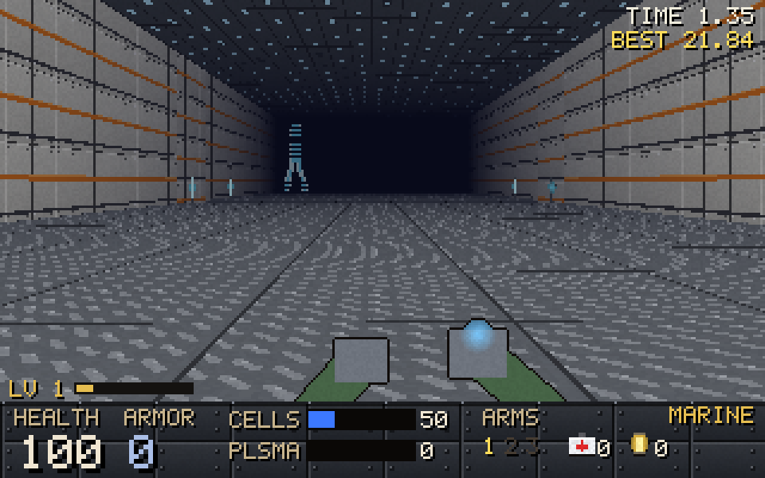
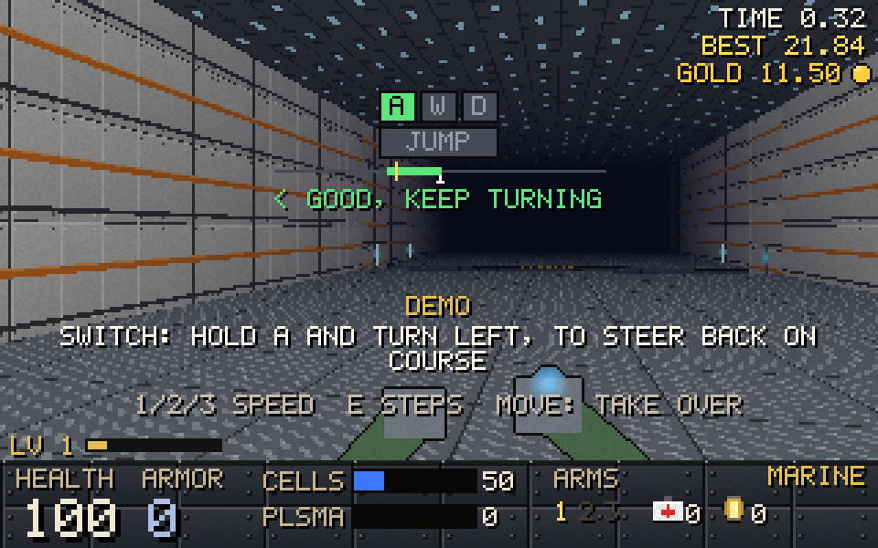
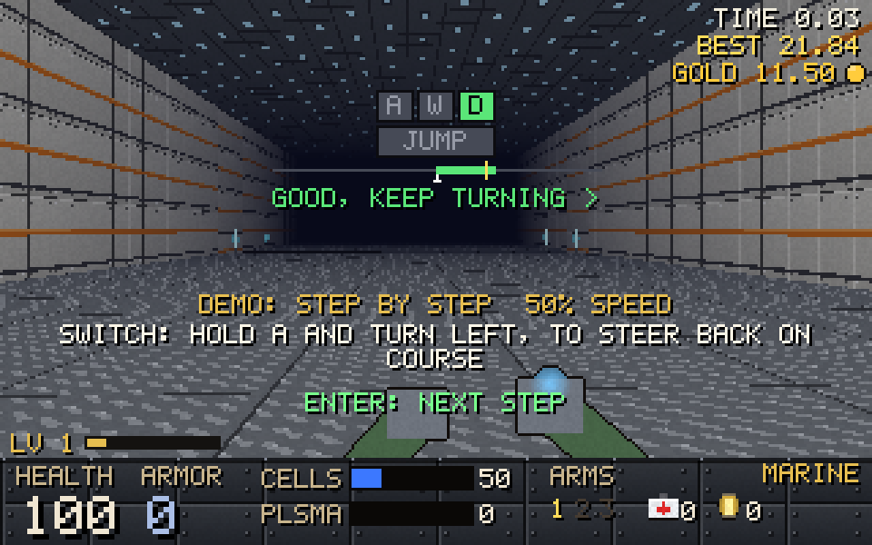
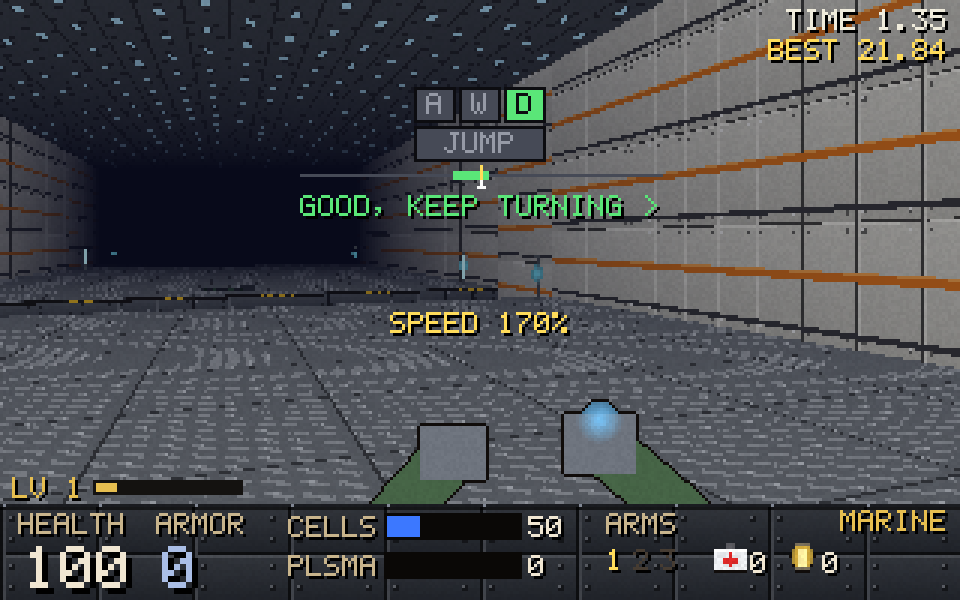
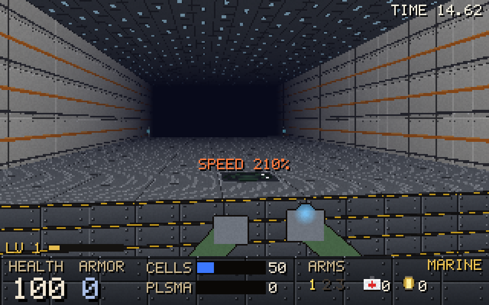
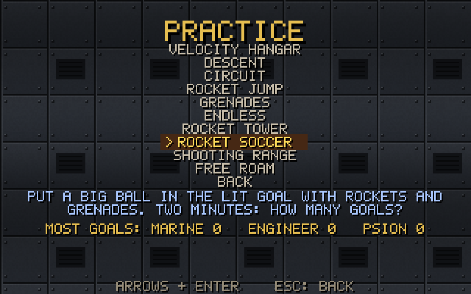
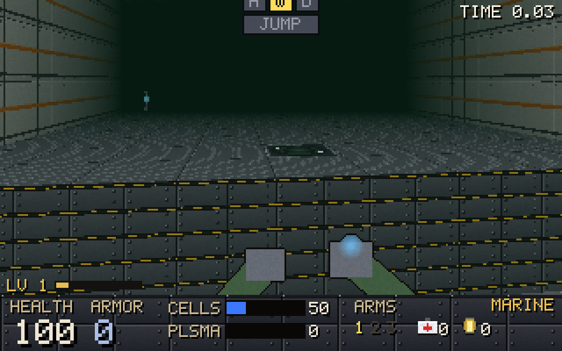
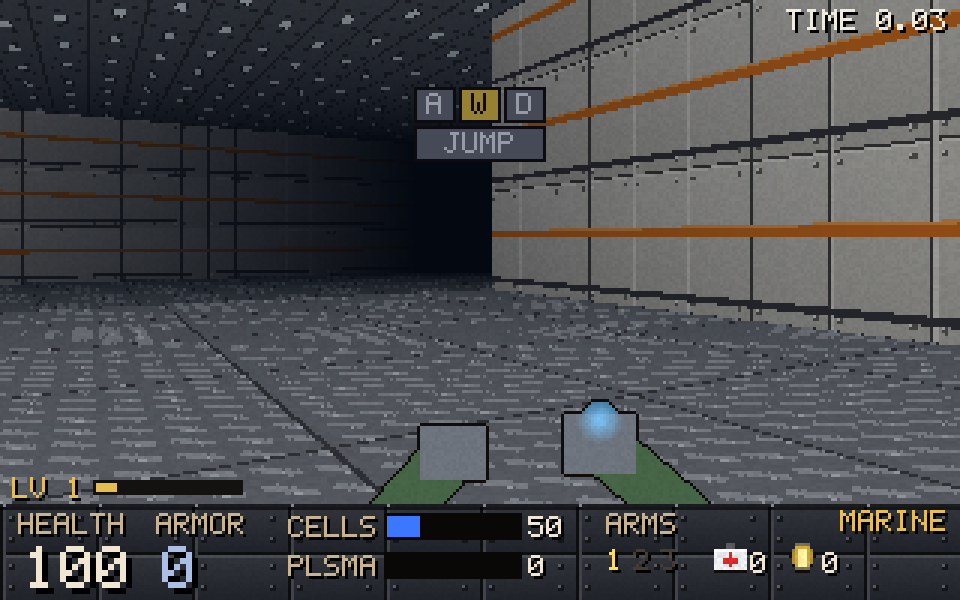
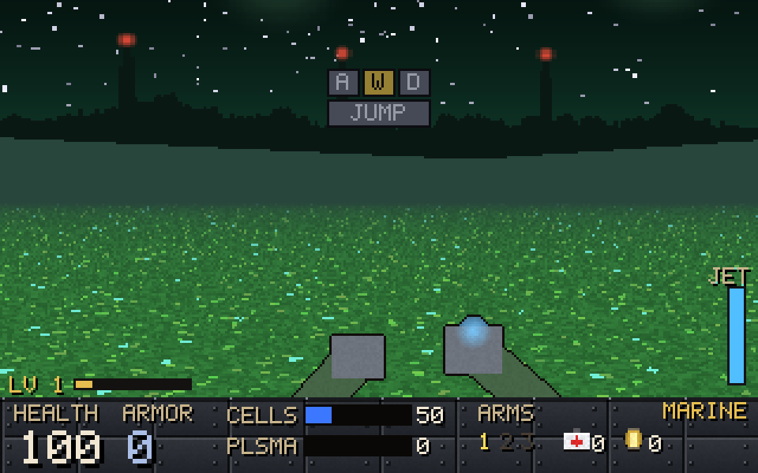
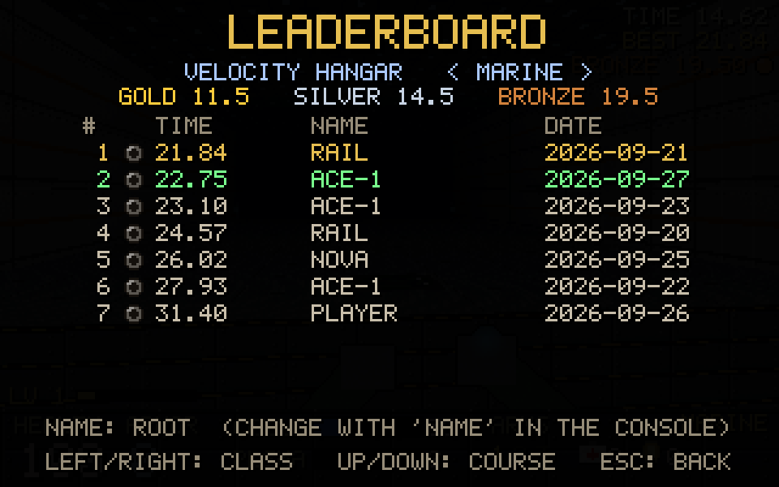

#### Ghost codes

Race a friend's ghost without being online together: send them your run as a code, and they race it.
- **Sharing a run:** open the console (`~`) and type `ghostcode`.
  - **On a timed course:** it shares your best there as your class.
  - **On the endless course:** it shares your last run on that seed.
  - **What you get:** the code is printed, copied to the clipboard and saved as a `.hxghost` file in the
    `ghosts` folder next to your profile. A 13-second run is about 700 characters.
- **Racing one:** copy their code and type `ghostload`: it reads the code off the clipboard. `ghostload <file>`
  loads a `.hxghost` file from your ghosts folder, or from anywhere by its path.
  - **Where it takes you:** to the code's course, or its endless seed, if you're not already there. You race as
    your class, or theirs if you load from the title.
  - **Whose ghost:** theirs runs in place of your own, until you type `ghostclear`.
- **What's in a code:** the course and seed, the class, the name, the time, and the path, one point every 50 ms to
  within 1/64 of a cell. It's compressed, in URL-safe text; line breaks from pasting don't matter, and a damaged code
  is refused.

#### The endless course

**Practice → Endless** builds a fresh course from a random seed each time you pick it. It's a run of platforms,
9 wide, over gaps with lift pads below, like the Velocity Hangar, but 50 platforms long and harder the further you get.

- **How it ramps:**
  - The first few gaps take a plain running jump.
  - After that the gaps widen, from about 2 cells to about 8.
  - The platforms shrink from 12 cells to 3.
  - From the fifth platform the floor starts dropping, more at a time the further you go, or rising a step. A drop
    buys hang time, so its gap is a cell wider; a rise costs some, so its gap is narrower.
  - By the last stretch the gaps need more than the top strafe-jumping speed (300% of your run), so nobody reaches
    the end. On seed 1234 as the Marine, strafe jumping gets you to platform 39.
- **One fall ends the run.** Falling onto a lift pad scores the platforms you reached past the first, puts the run
  on your class's endless board, and starts you again from the top on the same seed.
- **While you run:** the top-right corner shows the platform you're on out of 49, your best and the seed. Each
  platform tells you how fast you'll need to be for the next gap, as on the other gap courses.
- **What counts:**
  - Your first landing past the start starts the clock. The time only breaks ties between runs that reached the
    same platform.
  - Falling at the first gap isn't recorded.
  - Neither are runs at 50% or 25% speed, or the demo's.
- **Seeds:** Restart keeps the seed. `endless 1234` in the console plays seed 1234, and `endless` alone rolls a new
  one. The board lists each run's seed, so you can race a friend on theirs.
- **The board:** **Leaderboard** has an Endless page, between the timed courses and the arena. It keeps each class's
  ten furthest runs, the quickest first among equals.
- **The demo** plays it too. On seed 1234 it gets past platform 30 before the gaps outgrow it.
- **Into the Unknown:** reaching platform 25 earns the achievement.

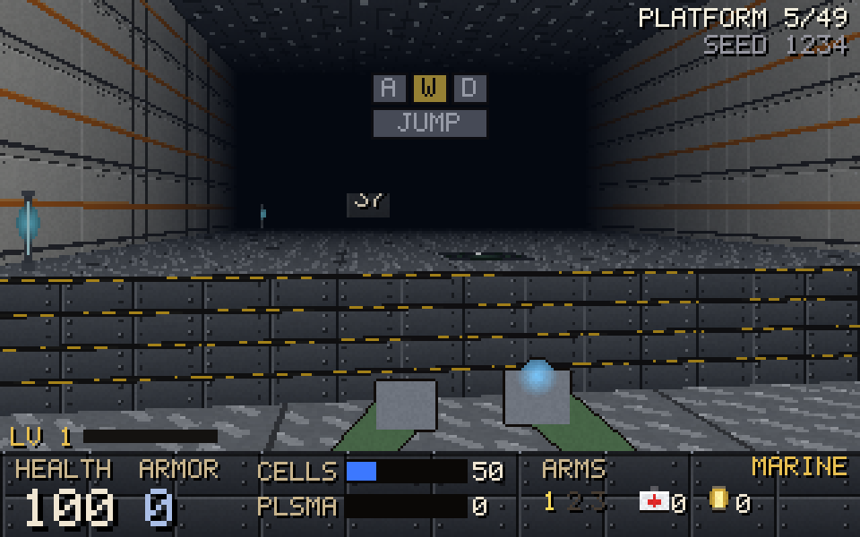
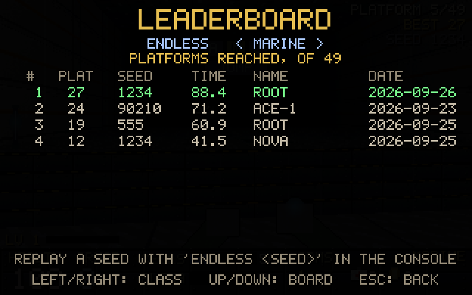

### Chaos Arena

**Arena** on the title menu opens its setup page, where you can switch on modifiers; **Start**, then a class,
puts you in the Chaos Arena on its own (it isn't part of the hub any more). You start in the armoury next to the
arena floor. Step on the golden altar when you're ready and the waves
begin. The run ends when you die, pick **Restart**, quit to the title or close the game.

- **Modifiers** (on the setup page, `Enter` or `Left`/`Right` to switch; kept between runs and saved with your
  settings). Each makes a run harder and adds to its score multiplier:

  | Modifier | What it does | Score |
  |---|---|---|
  | Double-speed monsters (S) | monsters move twice as fast | +60% |
  | No supplies (N) | no health, mana or items at the altar between waves, and the armoury is bare (arsenal upgrades still come) | +40% |
  | Melee only (M) | only your first weapon; the others won't come out | +50% |
  | Random class (R) | skips the class screen and rolls a class for every run | +15% |

- **Perks:** after each boss wave (every fifth), the next wave waits while you pick one of three perks with `1`,
  `2` or `3`. You can take each perk up to three times, and they last for the run. They're listed in the HUD's
  top-right corner.

  | Perk | Each rank |
  |---|---|
  | Rapid Fire | +20% fire rate |
  | Regeneration | heal 1 health every 2 seconds |
  | Chain Lightning | your hits arc to the nearest other monster within 4 units for 40% of the damage |
  | Might | +20% damage |
  | Swiftness | +10% speed |
  | Vitality | +25 max health, and a full heal |
  | Bloodthirst | heal 4 health for every kill |
  | Mana Font | 1 blue and 1 green mana a second (never offered with Melee only) |

- **Leaderboard:** each class has its own board of the ten best runs, ranked by **score**: 100 a wave cleared,
  times the modifiers' multiplier. So nine waves with S, N and M (x2.5, 2250) beat sixteen with none (1600).
  Ties go to more waves, then the quicker run (time is counted from the altar to the last wave cleared, not
  counting time spent choosing perks). Each run also shows its modifiers as letters, its time, name and date,
  and it keeps its kills. Open the board from the arena's pause menu or
  **Leaderboard** on the title menu, where `Up`/`Down` steps through the practice courses and the arena. A run
  that doesn't clear a wave isn't recorded. Runs saved before scores existed score 100 a wave.
- **Medals:** bronze for clearing wave 5, silver for 10, gold for 15, the same for every class and whatever the
  modifiers. Each medal
  means getting past one more round of Heresiarchs. You're told when a wave earns a new medal.
- **Arsenal upgrades:** after waves 3, 6, 9, 12 and 15 an upgrade appears on the altar (Blessed, Runed, Exalted,
  Mythic, Divine; Mk II to Mk VI in sci-fi). Each one powers up every weapon you carry for the rest of the run:
  +35% damage and +12% fire rate per tier, and longer melee reach. From tier 2, melee swings cleave through up to
  3 monsters (4 from tier 4) and ranged attacks fire 2 extra shots in a fan (4 from tier 4). From tier 3, every
  shot also splashes. Your weapon glows in the tier's colour, and the HUD shows the tier under the medal line.
  Upgrades only count in the arena, and each run starts from scratch.
- **HUD:** under the wave count, the top-right corner shows your best for the class and the next medal you
  don't have yet.
- **When you die:** it tells you the run's waves, time, kills and score, and where it placed. Press `Enter` to go
  again from the armoury.
- **Always a fight:** the arena is always classic, even if your last new game was relaxed. There are no
  treasure chests, but experience and skills work as usual (20 XP × the wave number per wave cleared).
- **Saving:** the board is kept with your profile.

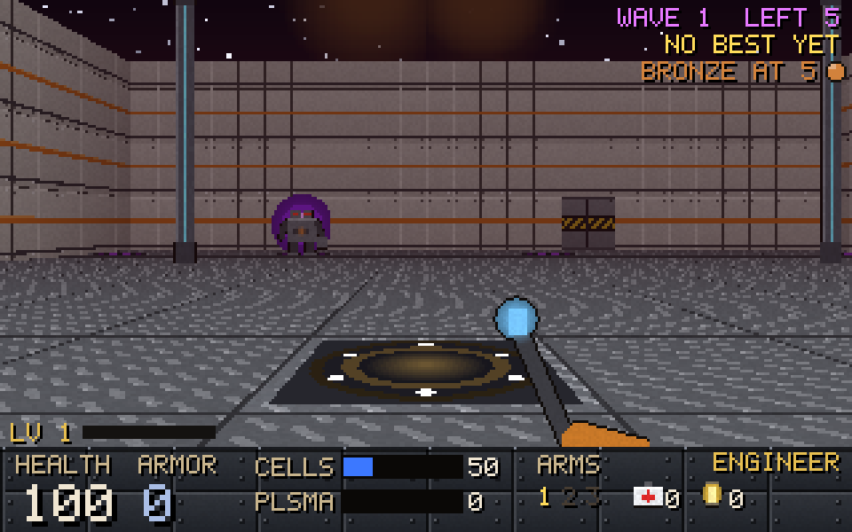
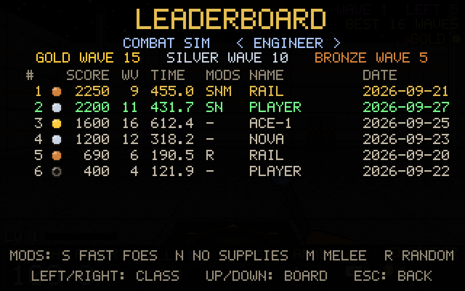
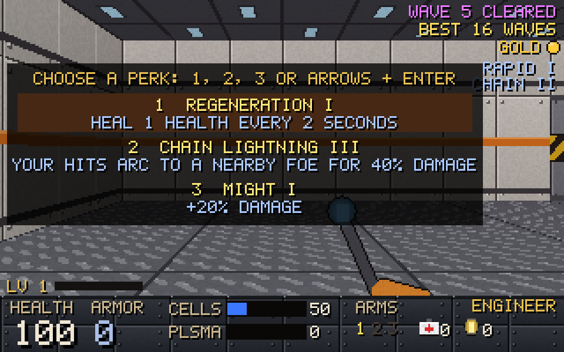
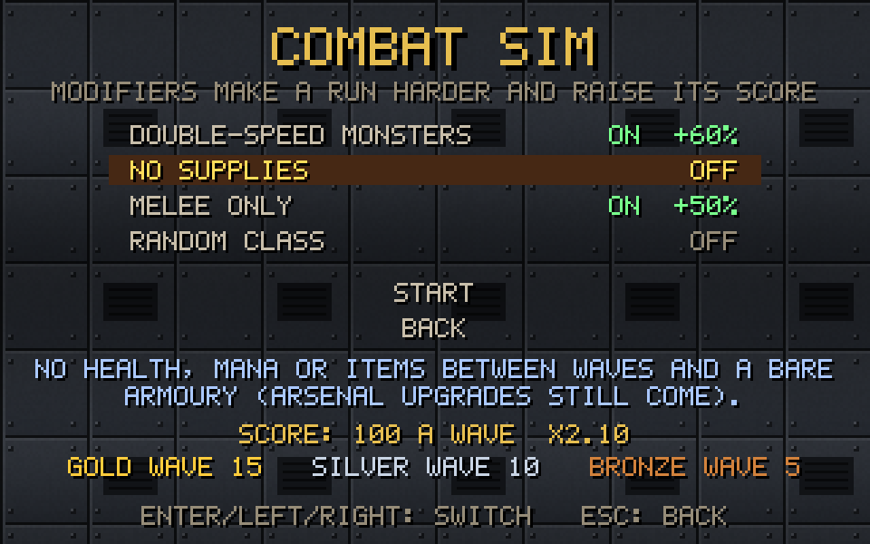

#### Daily challenge

**Daily challenge** on the Arena's setup page is an arena run set by the date (UTC), the same for everyone that day.
- **What the date sets:** your class and one or two modifiers (never random class). It also seeds the arena's dice:
  which monsters each wave brings, where they appear, and the perks on offer. So every attempt that day faces the
  same waves.
- **Scoring:** your first finished run of the day is your score for it (one per name, as set with `name`), scored
  like any arena run. Later runs that day are practice. It goes on its own board, not the arena's, and your own
  modifier picks aren't touched.
- **The board:** the leaderboard's **Daily** page (`Up`/`Down` from the arena's) ranks the day's names, with yours
  picked out. It shows the day's class and modifiers, your streak of days in a row and your best day. `Left`/`Right`
  step back through earlier days.
- **Old days:** `daily <yyyy-mm-dd>` in the console replays an old day's challenge, as practice only.
- **Regular:** finishing it on seven different days is the Regular achievement.

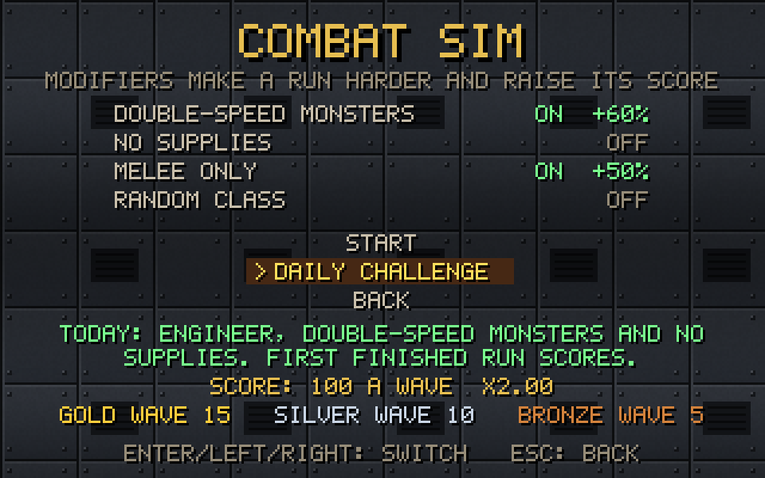
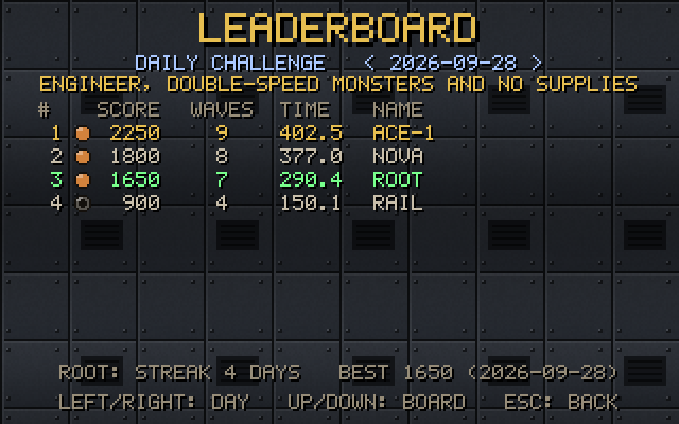

## Saving

The campaign saves itself to `save.json`, next to your profile. **Continue** heads the title menu whenever there's a
saved game, with your class, map and play time under it.

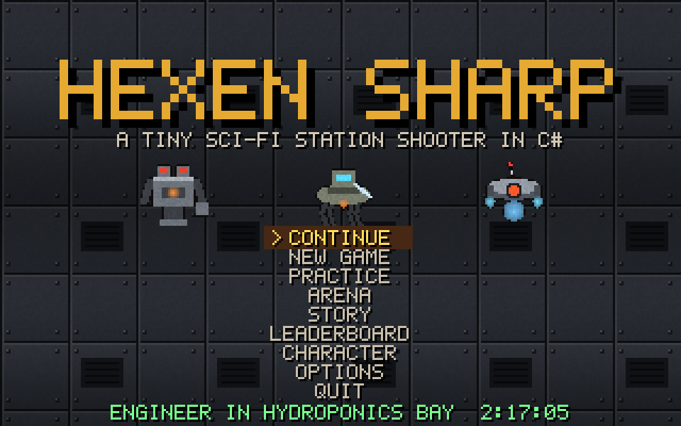

- **When it saves:** as you arrive in each map, at every checkpoint, every two minutes of play, when you quit to the
  title, and when you close the game.
- **What's kept:** the whole hub as you left it.
  - **Maps:** opened doors, pulled levers, broken rubble, moved blocks, dug floors and ceilings, found secrets, lit
    checkpoints and the automap.
  - **Things:** every monster (alive, hurt or dead), pickup, chest and lore stone, and the ship's repairs.
  - **You:** health, armor, mana, items, weapons, keys, ore, the jetpack, your checkpoint and play time.
- **What isn't saved:**
  - practice, the arena, Story mode and play-tested maps;
  - the moment you're dead;
  - flying through the Void Crossing. Quit mid-flight and you go back to your last save, on the Barren World.
- **Ending a campaign:** winning deletes the save, so there's nothing left to continue. Starting a **New game**
  replaces it; the style screen warns you when there's one.
- **Damaged saves:** a damaged save is ignored. So is one made before the maps changed shape, and it isn't
  overwritten either.

## New Game+

Beat the campaign in the classic style and the victory screen offers **New Game+**: press `Enter` to go round again
as the same class, or `Esc` for the title. From then on **New Game+** is on the title menu too, and starts the
highest tier you've opened.

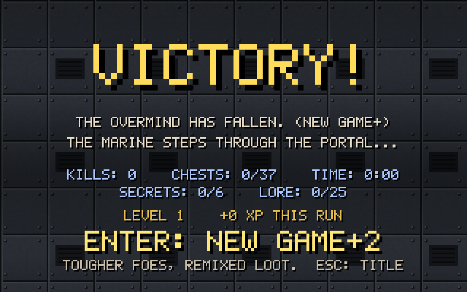
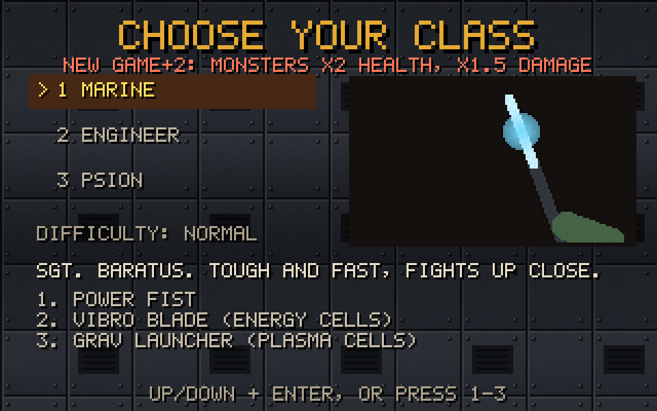

- **What you keep:** your level, skill points, skills and weapon levels, as always, since they live in your profile.
- **What changes at each tier:**

  | | Per tier | Tier 1 | Tier 2 | Tier 3 |
  |---|---|---|---|---|
  | Monster health | +50% | x1.5 | x2 | x2.5 |
  | Monster damage | +25% | x1.25 | x1.5 | x1.75 |
  | Monster speed | +8%, at most +40% | x1.08 | x1.16 | x1.24 |
  | Chests | +25% | x1.25 | x1.5 | x1.75 |
  | XP a kill | +25% | x1.25 | x1.5 | x1.75 |

- **Remixed loot:** the vials, flasks, urns, mana and armor on each map swap places, so a remembered route finds
  different things, and some vials have grown into flasks (15% a tier, at most half). Keys, weapons, relics and the
  jetpack stay where they are. Chests roll their loot fresh, as they always do.
- **Mini-bosses and the Heresiarch** are toughened like everything else; their health bars show the bigger health.
- **Tiers:** winning a tier opens the next, up to New Game+9. Your first New Game+ win earns **Once More, With
  Feeling**.
- **Only the campaign:** the relaxed style, practice, the arena and Story mode don't have tiers.
- **Saving:** a New Game+ campaign saves and continues like any other; the title's Continue line names the tier.
- **Weapon mods** are commoner in New Game+ chests, and every New Game+ mini-boss drops one. See
  [Weapon mods](#weapon-mods).
- **Hazards:** three maps turn against you in New Game+. Each tells you what's changed as you arrive.

  | Map | Hazard |
  |---|---|
  | **Bedrock Depths** | Stand still on a tunnel floor you've dug and it cracks after 0.6 s, then gives way at 1.3 s: it drops a step under you, for 5 damage. Each spot only drops once, so you can always step back out. Keep moving and it holds. |
  | **Windspire** | Every 9 seconds a gust blows for 2.5 s, in a new direction each time, and a GUST banner shows. It nudges you on the ground and pushes hard up on the heights, at up to 1.8 cells a second, so mind the edges. |
  | **Hanging Cisterns** | Every 40 seconds the floor floods for 8 s, with a warning 4 s ahead. Standing in it hurts, 4 damage every half second, and tints the view. Get up on a ledge until it drains. |

  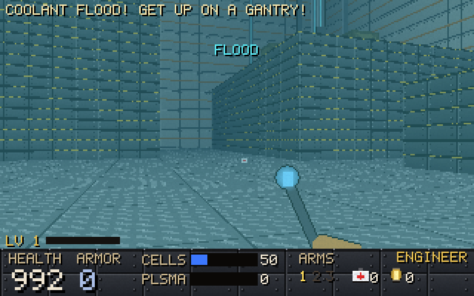
- **Ambushes:** a second run doesn't stay empty behind you.
  - **When:** walk back to somewhere you last stood more than 45 seconds ago, with nothing already after you, and
    for the next few seconds an ambush may come. The game looks every 2 seconds, with a 50% chance each time.
  - **Who:** a few of that map's own monsters, toughened for the tier, appear 5 to 9 cells away, out of sight if
    they can. There are 2 at tier 1, 3 at tier 2 and 4 from tier 3.
  - **How often:** at least 60 seconds between ambushes at tier 1 (8 fewer a tier, 30 at least), and at most 2 plus
    the tier on each map. None during a boss fight.

## Weapon mods

Rare attachments that change how a weapon behaves. There are four, each a glowing emblem in its own colour:

| Mod (fantasy / sci-fi) | What it does |
|---|---|
| **Rune of Piercing** / **Piercing Core** (gold) | Shots go on through two more monsters after the first; melee blows cleave one more. |
| **Storm Rune** / **Arc Coil** (blue) | A third of your hits arc on to the two nearest monsters within 4 cells, for half the damage. |
| **Rune of Gathering** / **Capacitor** (pink) | Hold Fire to charge (a bar fills under the crosshair, full in 0.8 s); let go to fire for up to 2.5x damage, and a bigger shot. A tap still fires as usual. |
| **Frost Rune** / **Cryo Emitter** (pale blue) | A hit slows the monster to half speed for 2.5 seconds. |

- **Where they come from:** chests, rarely (about one in 25 in a first campaign), and more often in New Game+
  (about one in 10 at tier 1 and one in 6 at tier 2). In New Game+ every mini-boss drops one too.
- **Fitting one:** walk over it and it fits the weapon in your hand, replacing that weapon's mod if it had one. Each
  weapon carries one mod at most, so switch to the weapon you want it on before you pick it up. One your weapon
  already has stays on the floor.
- **On the HUD:** the weapon in hand's mod shows by the level bar, in its colour.
- **Saving:** your weapons' mods are kept in the save, for the rest of the campaign.

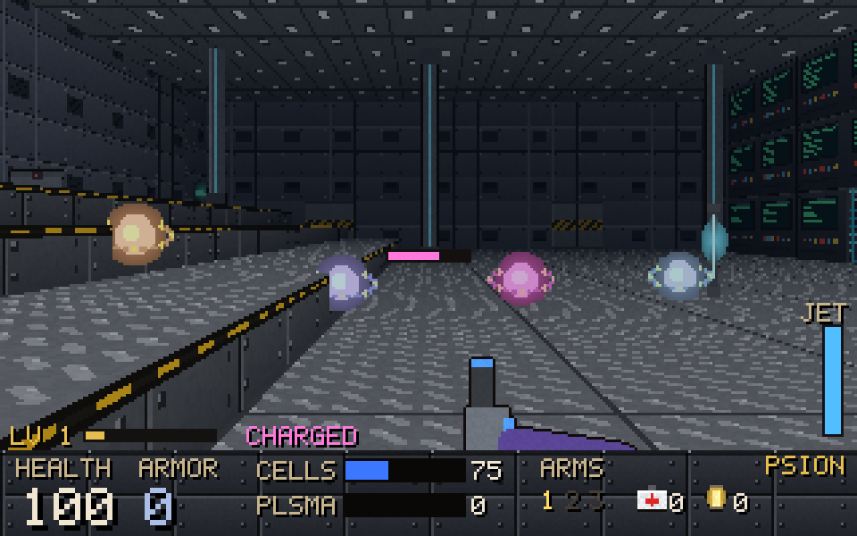

## Walkthrough (spoilers)

Names here are the fantasy ones. In the sci-fi style: Winnowing Hall = Hab Ring, Frozen Keep = Cryo Labs,
Darkmere Crypt = Hydroponics Bay, Chaos Arena = Combat Sim, Windspire = Comms Spire, Steel/Fire Key = blue/red keycard, lever = switch,
portcullis = force field, Heresiarch = Overmind, relic = artifact, lore stone = data terminal.

1. In Winnowing Hall, grab the class weapon piece in the north-east room.
2. Pull the lever on the great hall's south wall. The portcullis opens to the courtyard.
3. Step on blue portal **1** to reach the Frozen Keep and grab its weapon piece (middle room).
   The east room is behind a fire door.
4. Take portal **2** (the Keep's west room) to Darkmere Crypt. Pull *both* levers (north-east and south-west rooms)
   and push the two stone blocks in the south-east room onto its two pressure plates to raise the gate to the
   **Fire Key**. (Push each block north twice, then out to the plate on its side.)
5. Back in the Keep, open the fire door and pull the lever on the east wall. The vault gate rises.
6. Step on portal **4** in the vault to reach the Windspire. Bring the jetpack from Winnowing Hall's start room;
   there's a spare by the arrival portal too. Go through the opening into the tower and fly clockwise from the
   lowest ledge:
   - south-east ledge (1.5)
   - east pillar (2.5)
   - north-east ledge (3.5)
   - north pillar (4.5)
   - north-west ledge (5.5)
   - west pillar (6.5)
   - south-west ledge (7.5)
   - then across to the summit (8.5) in the middle

   Land on each ledge to let the tank recharge and light its checkpoint. If you fall, the lift pad by the tower's
   opening takes you back up to your highest checkpoint. Pull the beacon lever and step off the summit (there's no fall
   damage). Then take the **Steel Key** from the vault at the foot of the tower, along with a Mystic Urn, armor and
   mana. The secret wall is at the east end of the north-east ledge.
7. Take portal 4 back to the Keep, then portal 1 to Winnowing Hall, and open the steel door off the courtyard.
   Kill the Heresiarch, then step on the red exit rune.

Optional: portal **5**, near the courtyard's south wall, leads to Deepdelve Quarry. Smash east through the rubble into the
gallery, dig down through the rock field (the pockets hold loot, the middle cave a drone), and keep digging south-west
to the strongroom's door, or south-east straight into the strongroom. Its secret wall is at the east end.
Portal **6** in the strongroom leads down to the Bedrock Depths, where there's nothing but rock to dig.
Portal **7**, in the courtyard between its two northern trees, strands you on the Barren World until you've mined
enough ore to repair your ship. Then fly it through the Void Crossing to the Verdant Moon, whose portal 9 brings you
back to the courtyard.

Optional: portal **3**, towards the courtyard's east wall, leads to the **Hanging Cisterns**, a block-puzzle map
you'll need the jetpack for (a spare waits by the portal).
- **The ledges:** three hang high above the drained cistern's floor, stepping up 1.5 at a time so one tank of
  fuel reaches the next. Each has a checkpoint pad, and a lift pad on the floor takes you back up.
- **The puzzles:** each ledge is a stone-block puzzle. Push blocks with `E` and pull them with `Shift+E` onto
  its pressure plates, and remember blocks only slide on level stone.
  - **Low ledge:** two blocks, pillars in the way.
  - **Middle ledge:** two blocks. One has to be pulled, as a lore stone in the antechamber hints.
  - **High ledge:** three blocks, a fourteen-move puzzle.
- **The vault:** with every plate weighed down, pull the lever on the high ledge's east wall. The portcullis to
  the vault in the north-west lifts, with a Mystic Urn, armor, a flask and mana inside.
- **The secret:** a secret wall in the antechamber's south-west corner hides a nook.

The ledge puzzles were designed with `tools/puzzles/solve_blocks.py`, a small solver that searches every push and
pull. Run it to check a redesign still works; it prints the moves the self-test plays through.

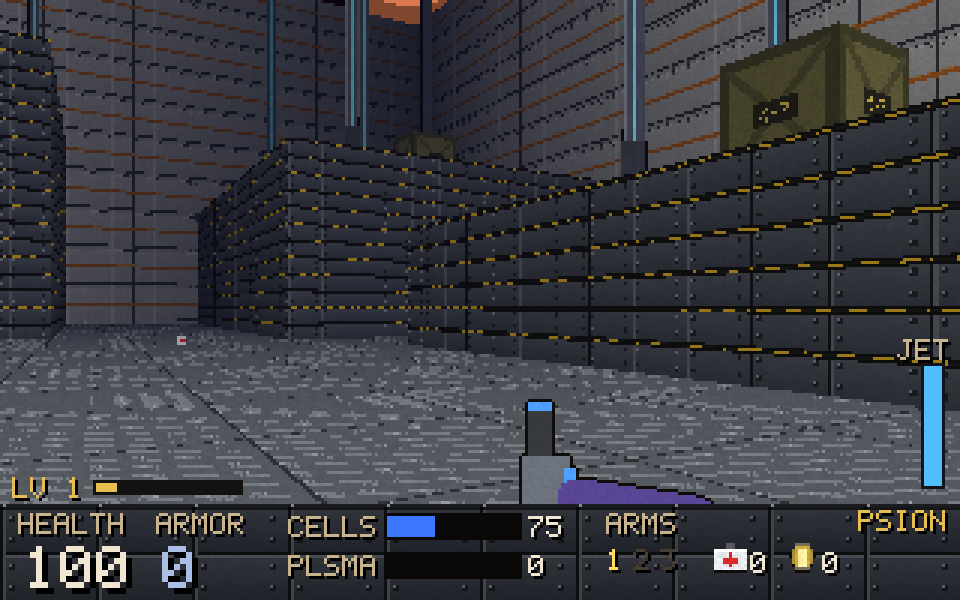
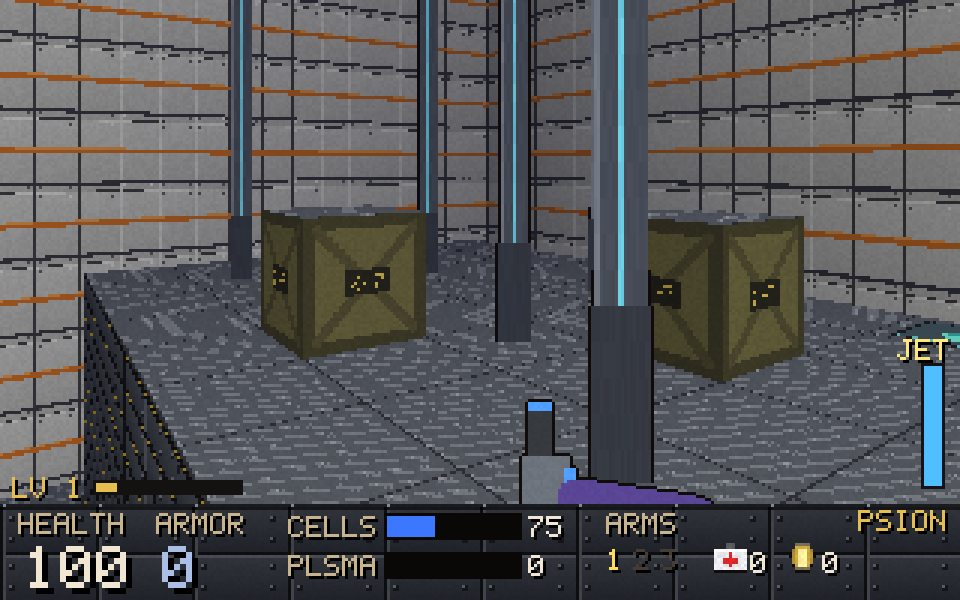

**Relaxed mode:** the route is the same, but instead of killing the Heresiarch you need all 26 relics, which
are spread over all ten maps (including the Windspire and the Hanging Cisterns, where some sit on high ledges, and the
Bedrock Depths, where they're buried in the rock) before the
exit rune wakes. Secret walls sit in the wall
between Winnowing Hall's great hall and courtyard (open it from the courtyard side), under the Keep's west room,
under the crypt's south-west room, at the east end of the Windspire's
north-east ledge, at the east end of the quarry's strongroom, and in the Hanging Cisterns' antechamber.

### Mini-bosses

Six of the optional maps each have a mini-boss. It's a bigger, recoloured version of one of the usual monsters,
with a trick of its own; a health bar shows low in the view while you fight it.

| Mini-boss (sci-fi) | Where | Its trick |
|---|---|---|
| **Quarry Warden** (Mining Mech) | Deepdelve Quarry, sealed in the cave in the middle of the rock field | Wakes when you come within 7 cells, even through rock, and burrows through the rubble to you. Up close it raises its fists and slams the ground for 25: jump just as they come down and it misses. |
| **Dust Stalker** (Rogue Harvester) | The Barren World's southern plain | Lowers its head, then charges in a straight line for 28 and a shove. Sidestep and if it hits rock it's stunned for a moment and takes double damage. |
| **Thornmother** (Hive Queen) | The Verdant Moon's meadow | Floats, fires seekers, and every 8 seconds calls two of her brood, four at most. They fall when she does. |
| **Drowned Keeper** (Coolant Wraith) | The Hanging Cisterns' floor | Flings fireballs, and each time it loses a fifth of its health it vanishes and reappears somewhere else, usually up on a ledge, so bring the jetpack. |
| **Rock Wyrm** (Borer Drone) | The Bedrock Depths' tunnels | Swims unseen through the rock around you: you'll see dust where it passes but can't hurt it. It bursts out of the wall beside you, breaking the rubble, bites, and after four seconds dives back in. Hit it while it's out. |
| **Storm Leviathan** (Void Dreadnought) | The Void Crossing, in flight | Drops out of the dark ahead as you fly, keeps a few lengths in front of you, weaving across the lane, and turns to fire volleys of three. Its loot hangs in the air where it falls. |

- **Loot:** each drops a Mystic Urn and armor and pays 250 XP on top of the kill.
- **Big Game Hunter:** beating all six earns the achievement, and your profile remembers which you've beaten.
- **Relaxed style:** they're as peaceful as everything else.
- **Console:** `summon warden`, `summon stalker`, `summon thornmother`, `summon keeper`, `summon wyrm` or `summon dreadnought` brings one to you.

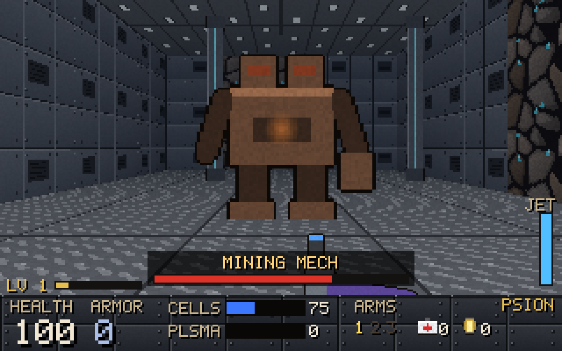
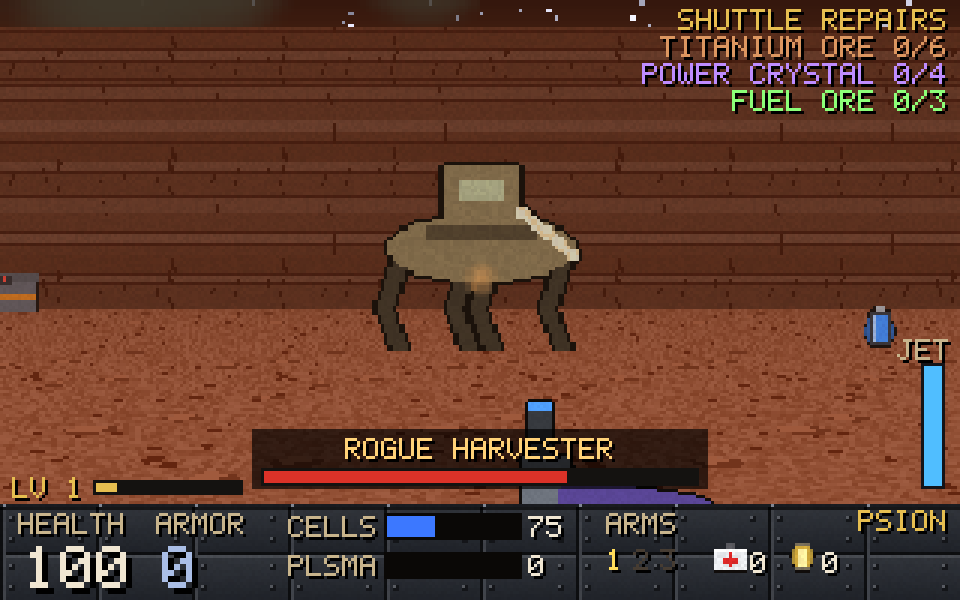
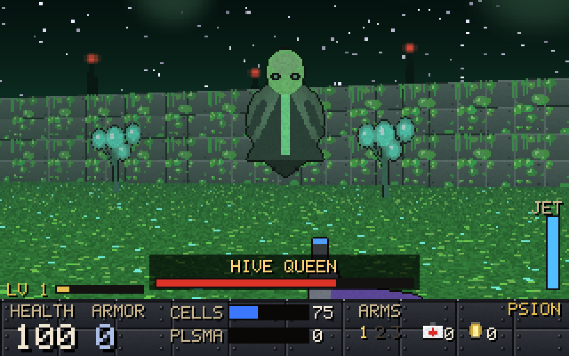
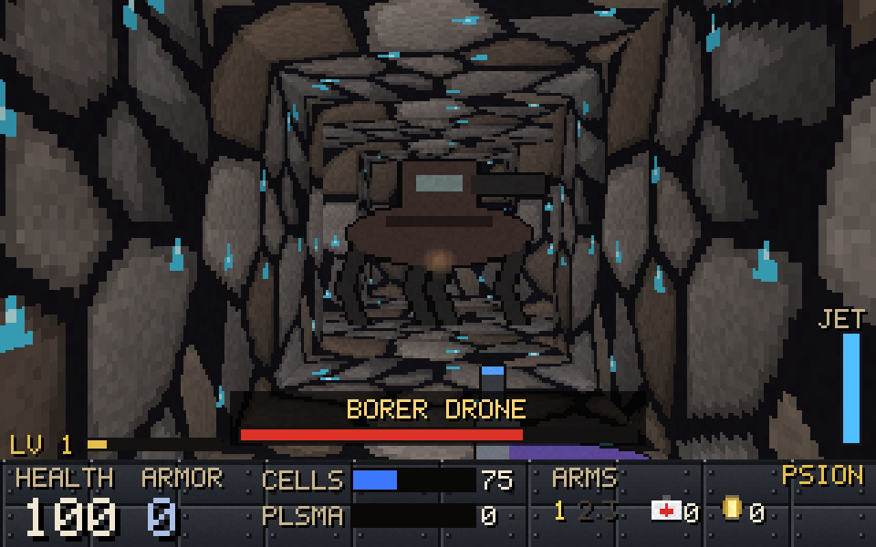
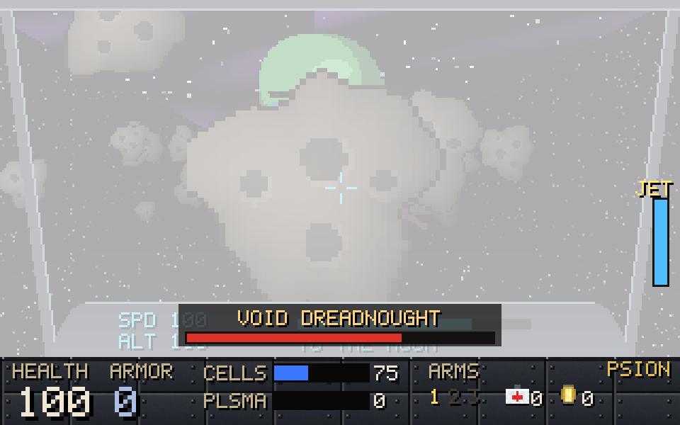

#### Rematches

**Arena → Rematch** lets you fight any mini-boss you've beaten again, against the clock.
- **The fight:** you pick a class and fight it alone on its own map, starting a little way off. The other monsters
  and the chests are gone. In the Void Crossing the Leviathan waits 30 cells down the lane, not at the far end.
- **The clock:** it runs from the start until the boss falls, and shows in the top-right corner with your best
  against that boss.
- **The board:** each boss has a board of its ten quickest wins, any class. See it under **Leaderboard**
  (Left/Right picks the boss) or next to each name on the Rematch page.
- **Nothing to farm:** a rematch pays no experience and drops no loot. It isn't saved, and doesn't count toward
  the codex.
- **Another go:** Restart on the pause menu, or dying, starts it over.
- **Locked:** a boss you haven't beaten in the campaign shows as `???` until you have.

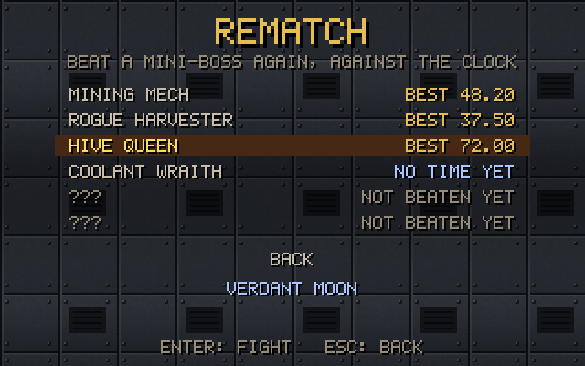
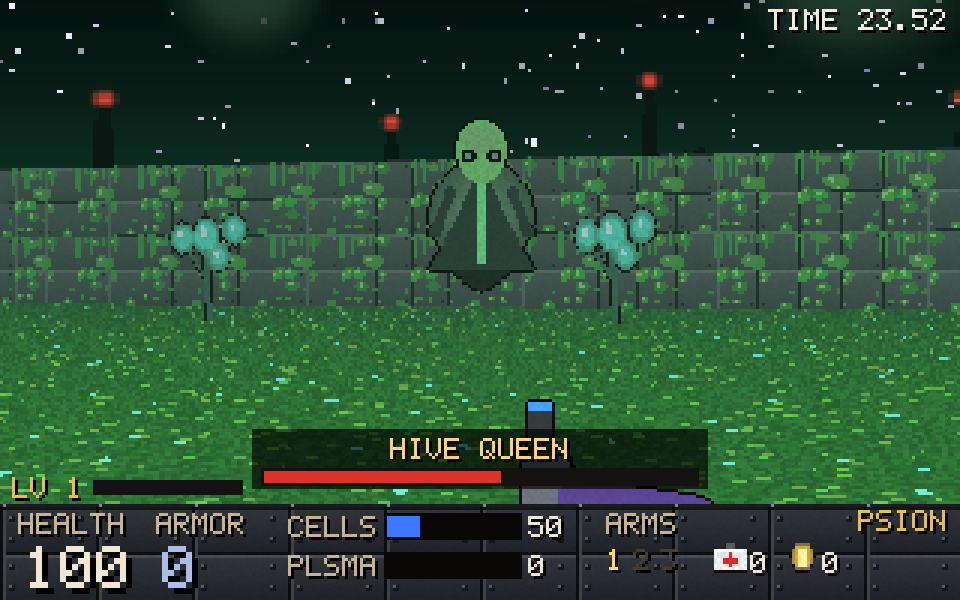
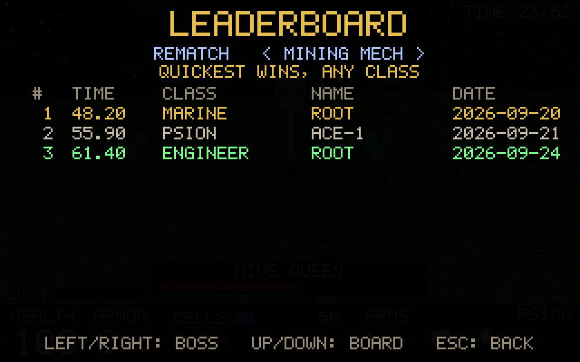
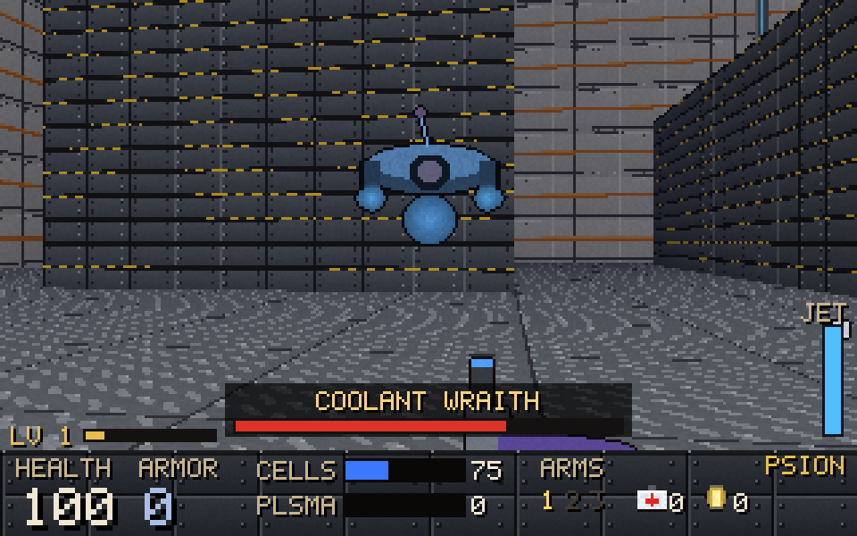

## Story mode

**Story** on the title menu. You're a private eye working jobs around **Neon Harbor**, a rain-slicked sci-fi town
of neon signs, lit windows and a skyline of towers. Each case has its own map, and you play it on foot, unarmed.
There's nothing to shoot; this is detective work.

- **The brief** opens each case: who's been hurt, what's gone missing, who to talk to.
- **Question people:** walk up to someone and press `E`. Ask where they were (their alibi), or ask about any clue
  you've found; each clue you find adds a question. Use `Up`/`Down` and `Enter`, and `Esc` to walk away.
- **Find clues:** glowing yellow evidence tags mark them. Press `E` to examine one; it goes in your journal and
  becomes something to ask about.
- **Catch the lies:** ask someone about a clue that contradicts their story and your journal flags it in red.
  Only the culprit lies.
- **Watch for patterns:** some clues only make sense together, like a staff roster and a list of spiked drinks at
  other clubs. Find both and the journal notes the pattern.
- **The journal** (`J`) keeps everything: people met, alibis, what they said about each clue, the clues themselves,
  lies and patterns. It tells you when you have the evidence you need.
- **Accuse** from the conversation menu:
  - Naming the culprit with the key evidence in hand gets a confession, and the next job comes in.
  - Naming the culprit without enough proof gets you nowhere, but costs nothing.
  - Naming the wrong person is a strike. Three strikes and the trail goes cold, and the case starts over.

The case, clue count and strikes sit in the top-right corner. The cases:

1. **The Missing Shipment** (Dockside): a crate of medical nanites vanishes from a warehouse overnight.
2. **Static on Channel 7** (the Chrome Lounge): a holo-news anchor's drink is spiked. It isn't the first time this
   month.
3. **The Ghost in the Grid** (the Grid District): every few nights the whole district blacks out.

Close all three to finish the story.

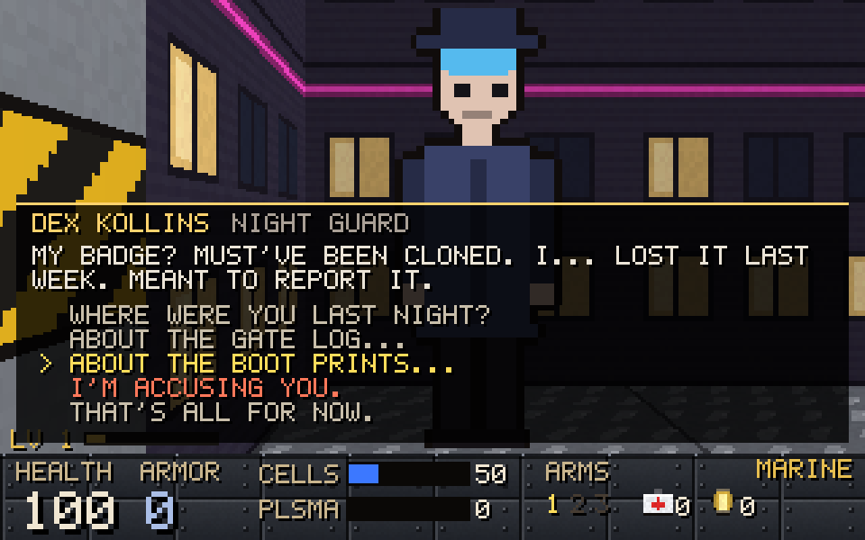

## Map editor

Maps are made in the browser editor, `tools/editor/index.html`. It's a single file with no dependencies: open it
straight from disk in any modern browser. The game has no built-in editor. It plays the `.hxm` files the browser
editor saves, and its checks give exactly the same messages.

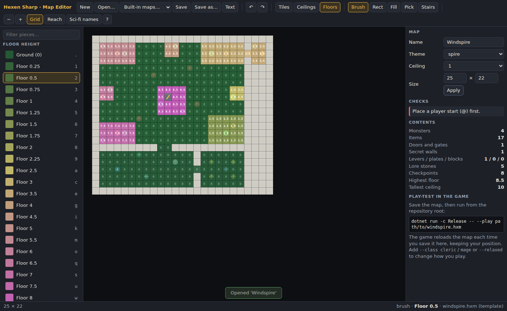

- **Painting:** brush, rectangle (Shift for a hollow room outline), flood fill and pick tools, with left-drag to
  paint, right-drag to erase and middle/Alt+click to pick. Every piece is in the palette, with sci-fi or fantasy
  names and a filter box.
- **Heights:** tiles, ceilings and floors layers, with heights shown as numbers over a colour scale and the full
  0–8.75 floor and 1–10 ceiling range. The stair brush climbs a step per cell.
- **Checks:** a live list (the game's checks plus extra hints such as missing keys or levers), with a click to
  highlight the cells involved. The **Reach** overlay shades everything you can't get to from the start or the
  arrival portal.
- **Editing:** undo/redo, zoom and pan, resize, and a **Built-in maps** menu to start from any hub map.
- **Files:** Save writes the file directly in Chrome and Edge (other browsers download it). You can also drag a
  file onto the page, or view/paste the map as text. Your draft is kept in the browser between visits.

**Edit and play side by side:** save the map from the browser, then start the game on it:

```sh
dotnet run -c Release -- --play path/to/my_map.hxm [--class cleric|mage] [--relaxed]
```

Every time you save in the browser, the game reloads the map and keeps your position, so you can tweak and test
without restarting. Winning, or **Esc → Restart**, plays the map again. The console command `playmap <file>` plays a
map file too. It also takes a name from the `maps` folder next to `settings.cfg` (`~/.config/HexenSharp/maps/` on
Linux, `%APPDATA%\HexenSharp\maps\` on Windows).

A map needs a player start (`@`). The checks warn about a missing or unreachable exit and anything that can't be
reached (on foot, or by flying if the map has a jetpack in it). A custom map without a Heresiarch has its exit open
from the start. Portal digits only link maps in the built-in hub.

**Heights and floors:** you can walk up a difference of 0.5 without jumping. Ceilings are absolute heights, kept at
least one storey above a raised floor. Doors are always one storey tall; when a taller room opens onto a lower cell,
wall is drawn above the opening. New maps default to 1.5; the built-in maps use 1 for corridors and doorways, up to
3.5 for the arenas and 10 for the Windspire.

**File format:** a `.hxm` file is plain text, so you can edit it by hand too.
1. A `name:`, `theme:` and `height:` (default ceiling height) header.
2. A `---` line, then the rows, using the map legend below.
3. Optionally, a second `---` line and a same-sized grid of ceiling heights: `2`–`9` = 1.0–4.5, then `a`–`k` =
   5.0–10.0 in half steps, `.` = default.
4. Optionally, a third `---` line and a grid of floor heights: `1`–`9` = 0.25–2.25, then `a`–`z` = 2.5–8.75 in
   quarter steps, `.` = ground.

Files without heights are one storey everywhere.

## Levels, skills and weapon levels

Everything you do earns experience, and your progress is saved between games (in `profile.json`, next to
`settings.cfg`). Dying, restarting and starting a new game all keep it.

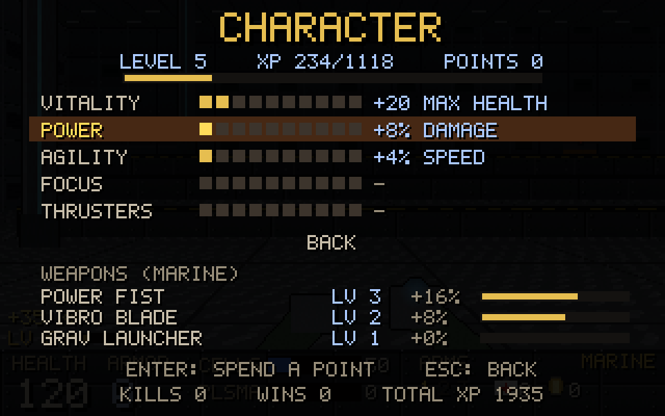
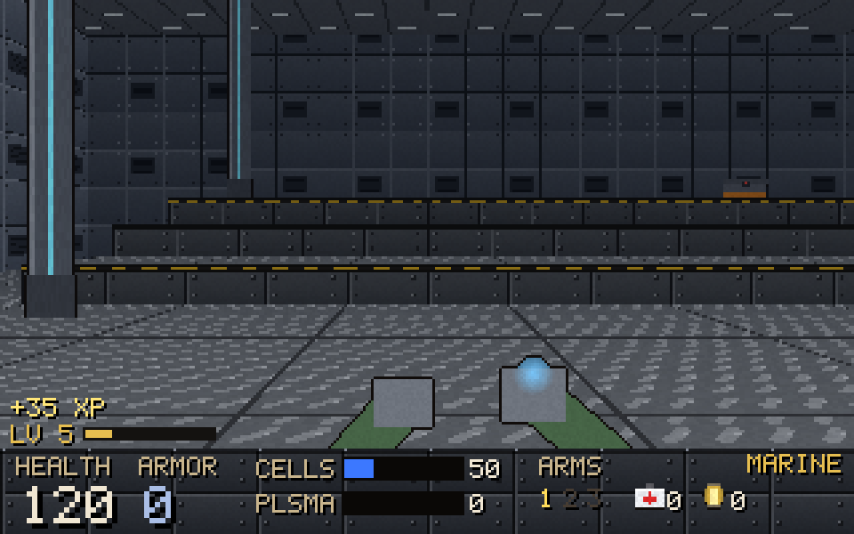

**Experience** (a "+XP" pop-up shows by the level bar in the bottom-left corner of the view):

| For | XP |
|---|---|
| Killing a monster | half its health: Afrit 17, Ettin 35, Bishop 45, Centaur 50, Slaughtaur 65 |
| Killing the Heresiarch | 350, plus a 500 bonus |
| Finding a secret / reading a lore stone (first time) | 50 / 25 |
| A relic / opening a chest | 40 / 15 |
| Clearing an arena wave | 20 × the wave number |
| Winning the game | 300 |

The first level takes 100 XP, and each after takes a bit more (282, 519, 800…), up to level 50. Custom maps you
play-test don't award experience.

**Skills:** each level gives a skill point. Press `K` (or pick **Character** on the title or pause menu) and spend
points with `Enter`. Every skill has 10 ranks:

| Skill | Per rank |
|---|---|
| Vitality | +10 max health (flasks, urns and vials heal up to it) |
| Power | +8% damage with every weapon |
| Agility | +4% movement speed |
| Focus | −6% mana cost and +5% attack rate |
| Thrusters (Wings in fantasy) | +15% jetpack fuel, and faster recharging |

**Weapon levels:** each weapon (per class) gains experience from the kills it makes, levels up to 10, and hits 8%
harder per level. The game announces each level-up, and the character screen shows every weapon's level and
progress.

**Achievements:** there are 24, listed under **Character → Achievements**. Each pays experience once, when it
unlocks, with a banner and a message; this works anywhere, practice and the arena included. The list shows which
you've got and when, and how far along you are with the ones that build up.

| Achievement | What it takes | XP |
|---|---|---|
| First Blood | Kill a monster | 25 |
| Slayer | Kill 500 monsters | 250 |
| Treasure Hunter | Open 50 treasure chests | 150 |
| Secret Keeper | Find every secret in one game | 200 |
| Loremaster | Read every lore stone in one game | 200 |
| Heresiarch Slain | Win the game in the classic style | 300 |
| Untouchable | Win in the classic style without dying once | 500 |
| Nightmare Walker | Win on Nightmare, start to finish | 750 |
| Once More, With Feeling | Win a New Game+ campaign | 400 |
| Into the Unknown | Reach platform 25 on the endless course | 300 |
| Pilgrim | Win in the relaxed style: find every relic | 300 |
| Jack of All Trades | Win as all three classes | 500 |
| On the Podium | Earn a medal on a practice course | 50 |
| Gold Standard | Earn gold on every timed practice course | 500 |
| Speed Demon | Reach 250% of your run speed | 150 |
| Gladiator | Clear wave 5 in the arena | 100 |
| Champion of Chaos | Clear wave 20 in the arena | 750 |
| Glutton for Punishment | Clear wave 5 in the arena with three or more modifiers | 300 |
| Overcharged | Take an arena perk to rank III | 100 |
| Veteran | Reach level 10 | 150 |
| Master of Arms | Raise a weapon to level 10 | 250 |
| Case Closed | Solve every case in Story mode | 300 |
| Big Game Hunter | Defeat every mini-boss on the optional maps | 500 |
| Regular | Finish the daily challenge on seven different days | 300 |

- **Hub game only:** the one-game ones (secrets, lore) count only in a game through the hub, not on practice
  courses, in the arena or on custom maps.
- **Earned early:** ones your profile has already earned, such as kills, levels, medals and arena records, unlock
  the first time the game checks.
- **No cheating:** achievements don't unlock in a game where you've cheated. That covers god mode, noclip,
  notarget, infinite mana or fuel, console commands such as `give`, `kill`, `summon`, `map`, `tp`, `xp`, `reveal`
  and `visitN`, gameplay settings changed with `set` (speed, fire rate, gravity and so on) and custom difficulty.
  Starting a new game clears it.
- **Saving:** they're kept in your profile.

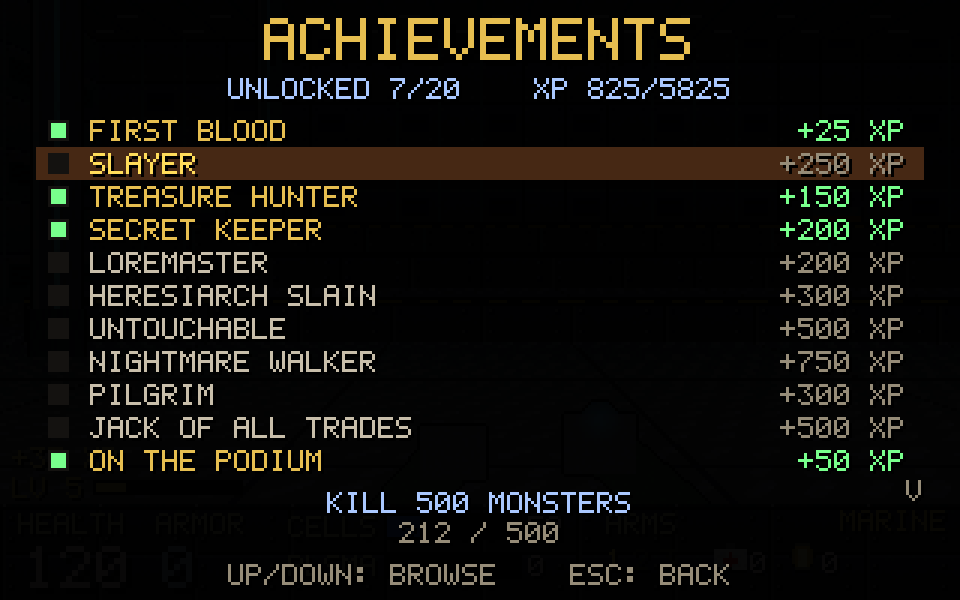

**Codex:** **Character → Codex** is a bestiary of all 12 monsters: the six regulars, the Heresiarch and the six
mini-bosses.
- **Locked entries:** each shows as `???`, with the monster as a black silhouette, until you first kill one.
  The game tells you when a new entry opens.
- **An open entry** shows the monster, how many you've killed, its health, a line of lore in the style you're
  playing, and how to beat it.
- **What counts:** your kills with your own weapons, in the campaign and the arena, not on practice courses or
  play-tested maps. A mini-boss you beat before the codex existed is already in it.
- **Saving:** your kills of each are kept in your profile.

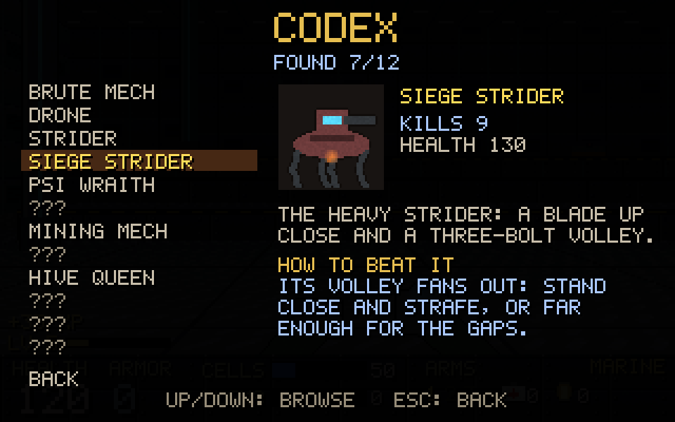
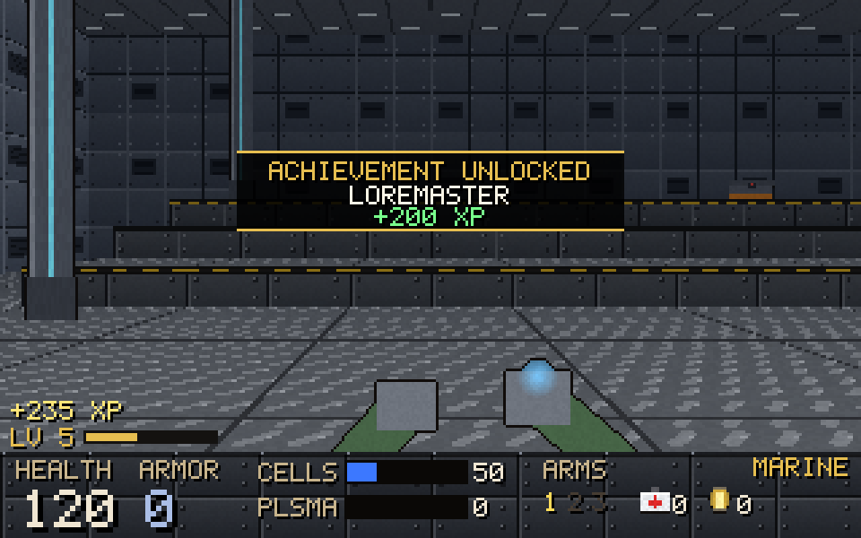

## Options and key bindings

Open **Options** from the title menu, or press `Esc` in game and pick Options.

- **Key bindings:** every action has a primary and a secondary key; keyboard keys, mouse buttons and the
  mouse wheel all work. Select a slot and press `Enter`, then press the new key (`Esc` cancels). `Backspace`
  clears a slot, `Left`/`Right` switch between slots, and **Reset to defaults** restores everything.
  Binding a key that's already in use moves it off the other action and tells you which.
- **Mouse sensitivity**, **Invert mouse**, **Field of view**, **Show FPS**, **Visual style** (sci-fi or fantasy),
  **Rendered art** (the Blender art pack over the sci-fi style), **HUD style**, **Crosshair** and **Movement** (Quake or
  classic, see [Quake movement](#quake-movement)): change with `Left`/`Right` or `Enter`.
- **HUD style** (also `H` in game, or `hud 0-3` in the console):
  - **Full**: the classic status bar along the bottom.
  - **Compact**: no status bar, so the view fills the screen. Health, armor and healing items sit in the bottom-left
    corner, both kinds of ammo (the one your weapon uses lit up) and your keys in the bottom-right; the level bar,
    jetpack gauge and block count move up to make room. In relaxed mode it lists relics, lore, secrets and how much
    you've explored.
  - **Minimal**: just your health and the ammo for the weapon in hand, small, in the bottom corners, plus any keys.
  - **Off**: nothing but the view. Messages, menus and wave banners still show.

  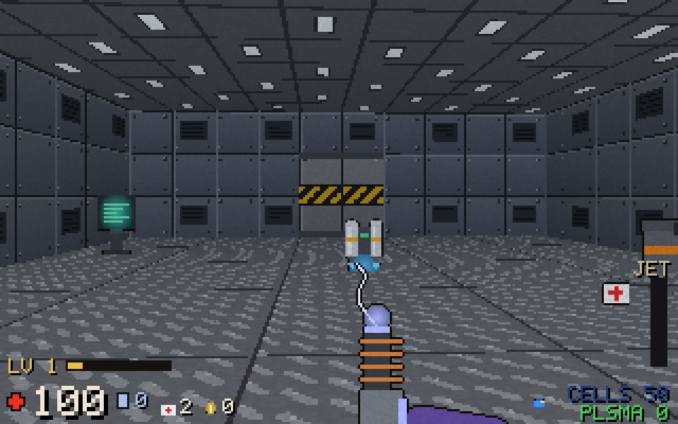
- **Arcade mode** (or `arcade 0|1` in the console), off by default, keeps your spirits up in a fight, the Chaos
  Arena especially:
  - **Damage numbers** pop out of every monster you hit, rising and fading, and a kill adds a `+bonus` on top.
  - **Score** in the top-right corner: each hit scores ten points per point of damage, times your style multiplier.
    A kill pays a bonus based on the monster's toughness, and clearing an arena wave pays 1000 per wave number.
  - **Style rank** under it, from **D** (DULL) through C, B, A and S up to **SS** and **SSS** (STYLISH!!!). It shows
    the rank, its title, a meter towards the next rank, the multiplier (x1 at D up to x7 at SSS) and your combo of
    hits. Keep hitting to climb. Kills, switching weapons between hits and hitting from the air all climb faster.
    The higher ranks take more to climb and drain faster. Stop fighting and the rank drains away; take a hit and it
    drops a whole grade and your combo breaks.

  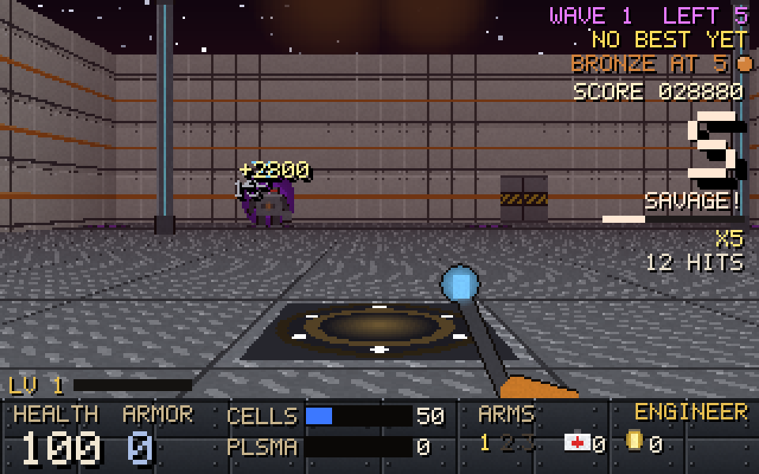
- **Difficulty** (or `difficulty easy|normal|nightmare` in the console): presets for three existing settings.

  | Difficulty | Your damage | Monster damage | Monster speed |
  |---|---|---|---|
  | Easy | 125% | 50% | 85% |
  | Normal (the default) | 100% | 100% | 100% |
  | Nightmare | 100% | 175% | 135% |

  The class screen shows the one you're on. Changing `damage`, `monsterdamage` or `monsterspeed` in the console
  makes it **Custom**. Custom lasts only the session, and arena runs on it aren't recorded. In the arena, Easy
  halves a run's score and Nightmare multiplies it by 1.5; the leaderboard marks those runs `E` and `X`. Relaxed
  mode has no fighting, so difficulty doesn't matter there.
- **Music volume** (or `music 0-1` in the console): 60% by default, down to off. Every map theme has its own
  procedural loop, and so do the title and the practice courses. Each is composed in code from its tempo, key,
  mode, chords and drums, with a seeded melody. The same tunes play on organ, strings and flute in the fantasy
  style, and on saw pads, square arpeggios and drum machines in sci-fi. Moving between maps crossfades from one to
  the next. `--sounds dir` exports the loops as WAV files along with the sound effects.
- **Effects** opens a page of game-feel settings, each also a console command:

  | Setting | Default | What it does |
  |---|---|---|
  | **Screen shake** (`shake 0-2`) | Normal | The view shakes when you're hit, in proportion to the damage, and when you land a heavy blow or a big kill; felling a boss shakes it hard. It settles within a second. Strong doubles it; Off turns it off. |
  | **Hit-stop** (`hitstop 0\|1`) | On | Heavy blows freeze the action for a split second: 45 ms for a hit of 40 or more, 70 ms for killing something with 100 health or more (a Centaur, say), and 140 ms for felling a boss. Your view still turns. |
  | **Damage numbers** (`damagenumbers 0\|1`) | Off | Numbers pop out of what you hit, as in arcade mode, but without its score: white, orange for a heavy blow. Arcade mode always shows them. |
  | **Boss intros** (`bossintros 0\|1`) | On | The first time a mini-boss or the Heresiarch notices you, its name card appears: letterbox bars slide in, the view zooms in a touch, it roars, and its name and a line about it show in the lower third for under three seconds. Once per boss. Nothing's hostile in the relaxed style, so there are none there. |
  | **Dynamic music** (`dynamicmusic 0\|1`) | On | Every track has a tension layer, locked to it: driving drums, a bass pulsing in eighths and a sixteenth-note arpeggio. It swells in over a second and a half while a monster near you is onto you or a boss is in the fight, and dies away over five seconds once it's clear. Not on the practice courses, or in the relaxed style. |

  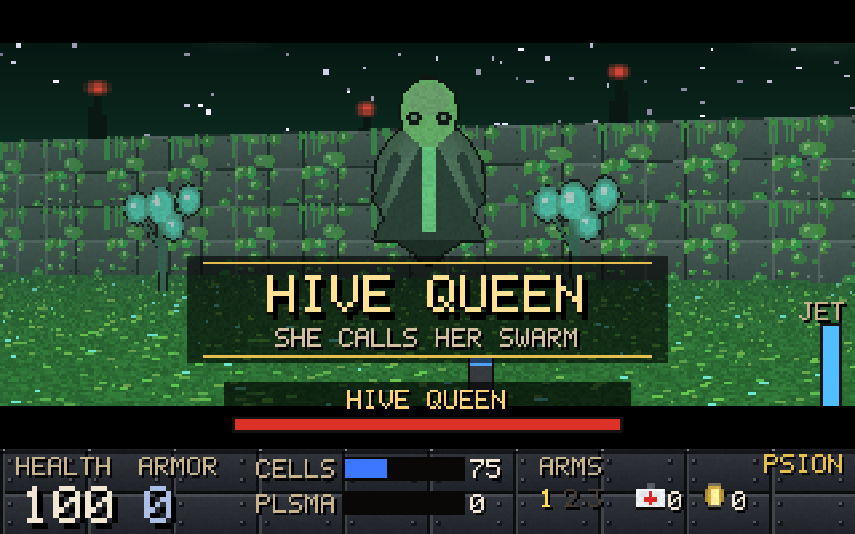
  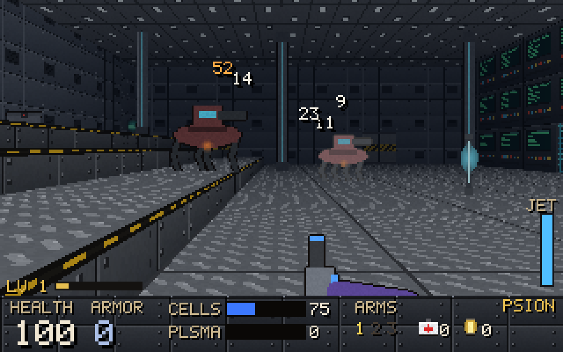
  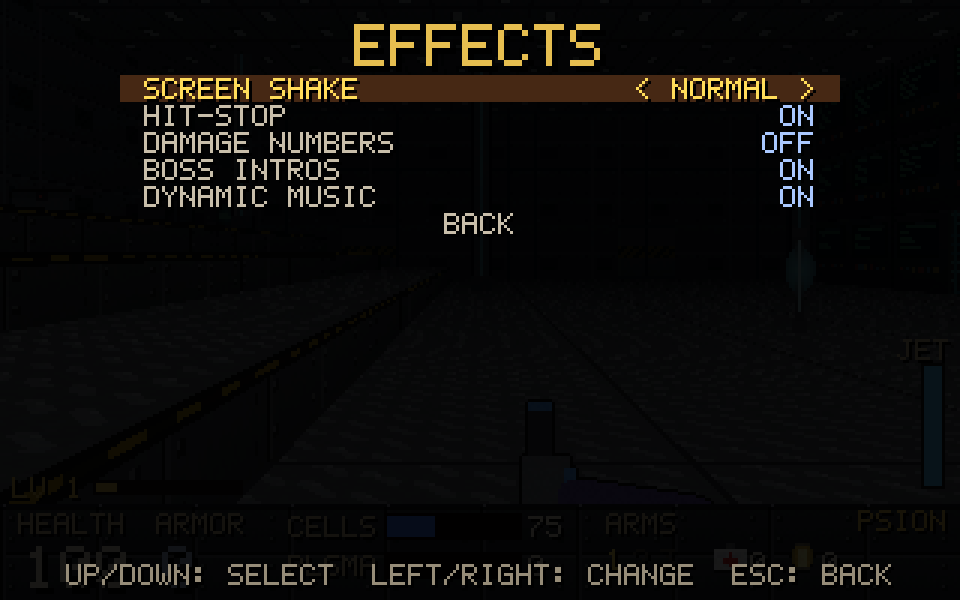
- **Crosshair** (or `crosshair 0-3` in the console): off (the default), a dot, a cross or a circle, drawn light with
  a dark outline at the centre of the view, where your shots go. It follows the horizon when you look up or down,
  works with any HUD style, and hides on the automap and in the cockpit (which has its own gunsight).
- `Esc`, `Enter` and the arrow keys always work in menus, and `Esc` can't be bound, so a bad binding can
  never lock you out.

Settings are saved when you leave the Options menu and when you quit, to `settings.cfg` in your user
config folder (`~/.config/HexenSharp/` on Linux, `%APPDATA%\HexenSharp\` on Windows,
`~/Library/Application Support/HexenSharp/` on macOS). The file is just console commands, so you can edit it
by hand.

## Console and cheats

Press `~` to open the console (the game pauses). `Tab` completes names, `Up`/`Down` recall history,
`PgUp`/`PgDn` scroll, `Esc` closes. Type `help` for everything; the most useful commands:

| Command | Effect |
|---|---|
| `vars` | list every tweakable setting and its current value |
| `bind [action] [key] [key2]` | show or change key bindings, e.g. `bind jump space mouse2` |
| `unbind <action>`, `binddefaults` | clear an action's keys / restore every default |
| `set <var> <value>` (or just `<var> <value>`) | change a setting, e.g. `speed 1.5`, `fov 90`, `gravity 6` |
| `reset` | restore default settings |
| `god`, `noclip`, `notarget`, `freeze` | toggles |
| `give all\|health\|mana\|weapons\|keys\|items\|armor\|jetpack` | give yourself things |
| `summon <ettin\|afrit\|centaur\|slaughtaur\|bishop\|heresiarch\|warden\|stalker\|thornmother\|keeper\|wyrm\|dreadnought\|flask\|...>` | spawn something in front of you (warden to dreadnought are the mini-bosses) |
| `map <number\|name>` | warp to a hub map (`map 4` = Windspire, `map 5` = Deepdelve Quarry, `map 6` = Bedrock Depths, `map 7` = Barren World, `map 8` = Void Crossing, `map 9` = Verdant Moon, `map 10` = Hanging Cisterns) |
| `arena [class]` | start a run in the Chaos Arena (as your current class unless you name one) |
| `difficulty [easy\|normal\|nightmare]` | show or set the difficulty |
| `daily [yyyy-mm-dd]` | play the daily challenge (an old day's is practice only) |
| `renderthreads [1-8]` | how many threads draw the 3D view (all your cores by default, up to 8) |
| `arenamods [letters\|-]` | show or set the arena's modifiers: `S` double-speed monsters, `N` no supplies, `M` melee only, `R` random class, `-` none |
| `chests` | list this map's chests and how many you've opened |
| `seed <n\|random>` | fix the chest layout (applies on `restart`) |
| `mode <classic\|relaxed>` | start a new game in a play style |
| `playmap <file\|name>` | play a custom map file (made in the browser editor) |
| `artstyle <scifi\|fantasy>` | switch the visual style |
| `renderedart [0\|1]` | use the Blender-rendered sci-fi art pack (off by default) |
| `xp <amount>`, `skill <name>` | give yourself experience / spend a skill point |
| `profile [reset]` | show your level, skills and totals, or start your progress over |
| `name [name]` | show or set the name your practice course times go on the leaderboard under |
| `demo` | on a practice course, start the demo run from the beginning |
| `ghostcode` | share your best on this timed course (or your last endless run) as a code: printed, copied and saved to a file |
| `ghostload [file]` | race a friend's ghost from the code on the clipboard, or a `.hxghost` file; `ghostclear` goes back to your own |
| `endless [seed]` | play the endless practice course on a new seed, or on the one you name |
| `kill`, `reveal`, `pos`, `tp x y`, `class <name>`, `restart`, `quit` | misc |

Settings: `speed`, `sens`, `invertmouse`, `damage`, `monsterdamage`, `monsterspeed`, `firerate`, `manacost`, `fog`, `fov`,
`gravity`, `jump`, `slidespeed`, `chests` (per 200 floor cells, next game), `god`, `noclip`, `notarget`, `freeze`, `infinitemana`, `infinitefuel`, `fullbright`, `showfps`, `hud` (0 full, 1 compact, 2 minimal, 3 off), `crosshair` (0 off, 1 dot, 2 cross, 3 circle),
`quakemove` (1 Quake movement, 0 classic) and its tuning: `accel`, `airaccel`, `friction`, `maxhop` (top speed as a multiple of your run speed), `ghost` (race your best practice run), `strafehelp` (0 off, 1 practice course, 2 everywhere), `music` (volume, 0-1), `padlook` (gamepad look speed).

Hexen's cheat codes work when typed during play (or in the console):
`satan` (god), `casper` (noclip), `nra` (all weapons & mana), `indiana` (items), `locksmith` (keys), `icarus` (jetpack),
`clubmed` (health), `butcher` (kill all), `mapsco` (reveal map), `visitN` (warp to hub map N).

## Developer tools

```sh
dotnet run -c Release -- --selftest       # validates maps (reachability) and runs scripted gameplay checks
dotnet run -c Release -- --shots shots    # renders scripted screenshots headlessly into ./shots
dotnet run -c Release -- --sounds sounds  # writes every sound effect, both styles, as WAV files into ./sounds
dotnet run -c Release -- --bench [frames] # times the renderer on fixed views, from rooms to the tall open maps
dotnet run -c Release -- --play map.hxm   # play-tests a map file, reloading it whenever it's saved
dotnet run -c Release -- --check-map map.hxm   # prints the editor's checks for a map (exit code 1 if unplayable)
dotnet run -c Release -- --export-maps maps    # writes every built-in hub map as a .hxm file
dotnet run -c Release -- --export-editor-maps  # refreshes the HTML editor's built-in maps after changing src/Level.cs
NODE_PATH=$(npm root -g) node tools/editor/test_editor.cjs [shots]   # drives the HTML editor in headless Chromium
```

The self-test fails if `tools/editor/builtin-maps.js` is out of date with the maps in `src/Level.cs`. The editor test
needs Playwright and a `dotnet build -c Release`. It checks that every built-in map loads and saves back
byte-for-byte, that the web editor's checks match `--check-map`, and that painting, stairs, fill, undo and resizing
work.

**Renderer performance:** `--bench` renders nine fixed views, from the great hall to the Windspire and the Hanging
Cisterns, a few hundred times each, on one thread and then on all of them. It prints milliseconds per frame, the
95th percentile and frames per second for each view.
- **Threads:** the 3D view is drawn by several threads at once, a block of 16 columns at a time, one thread per
  core up to 8. `renderthreads 1` in the console draws it on the main thread instead, and the setting is saved.
  Every column is its own ray writing only its own pixels, so the picture is identical however many threads there
  are; the self-test checks that on every benchmark view.
- **Fast paths:** the wall and floor loops take a fast path for the usual case (no dig-map shading or highlight).
  The texture row steps down a wall in fixed point, floors look up a per-row distance table instead of dividing,
  and fog is worked out once a span.
- **Results:** this took the benchmark from 0.83 ms a frame to 0.54 on one thread and 0.43 on four (on the machine
  it was measured on). Rounding moves a few texels by one: about 700 of the screenshot tour's 7.4 million pixels.

**CI:** `.github/workflows/tests.yml` runs on every pull request and every push to `main`. It builds, runs the
self-test and the editor test (installing Playwright and Chromium), then renders the screenshot tour and uploads it as
a `screenshots` artifact, so each PR's screenshots can be looked through. Any failed check fails the run.

## Rendered art pack (Blender)

A pack of Blender-rendered sci-fi art sits on top of the procedural art as a toggle (**Options → Rendered art**,
or `renderedart 1` in the console). It's off by default and only affects the sci-fi style; anything it doesn't
cover keeps its procedural look. It covers:

- the 11 pickups: stim, medkit, nano canister, energy and plasma cells, both keycards, armor vest, jetpack and
  both weapon crates
- all six monsters: the drone, brute mech, strider, siege strider, psi wraith and the Overmind. Each has two walk
  frames (alternate steps, a bank or a bob), an attack frame (muzzle flashes, a raised arm cannon, casting hands)
  and a white-hot pain frame; the death frames are derived from them as usual. They're built bolder than the
  pickups, with brighter hulls, strong glows and a rim light, so they still read at a distance. The walkers are
  seen at a three-quarter angle to show their legs.
- five textures: the main station wall panels, white hull plating, the pipe wall, the deck floor and the mine's
  rubble (faceted rocks with ore glints; its crack stages are drawn over it in game)
- all nine first-person weapons, each with a resting and a firing frame: the Marine's power fists, vibro blade and
  grav launcher, the Engineer's shock baton, bio rifle and flamer, and the Psion's blaster, shard gun and arc rifle.
  They're rendered through a camera that matches the player's eye (the game's 74° field of view, cropped with a lens
  shift to the 128×80 weapon frame), so the barrels point toward the crosshair. Your armoured glove closes on
  each gun's pistol grip (or a blade's hilt), with a back plate and sleeve in your class colour and knuckle lights in
  its accent. The power fist's punch drives the right gauntlet out toward the crosshair and bursts off the knuckles
  in a ring of energy while the left pulls back

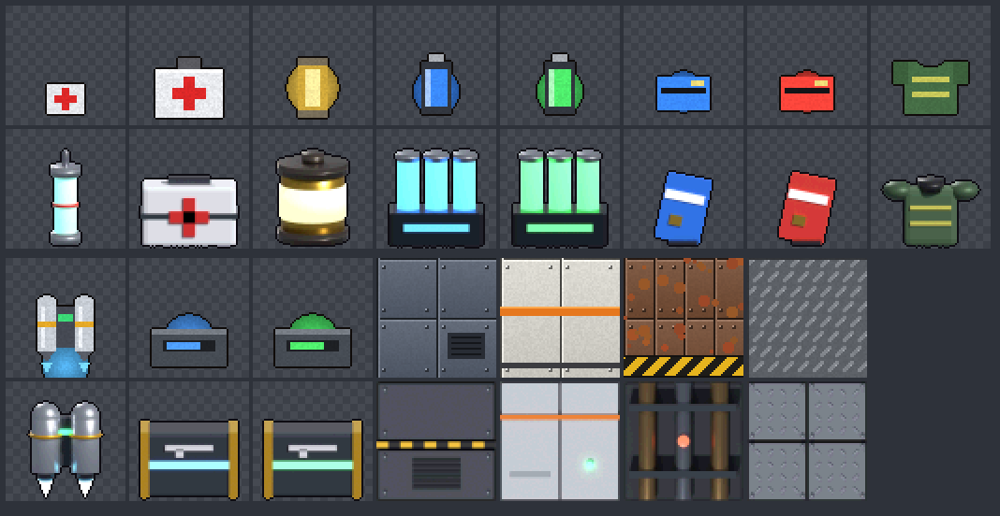
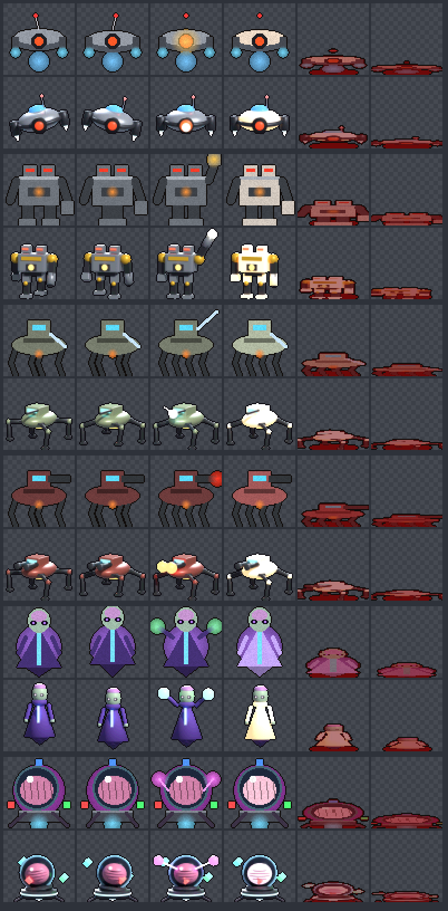
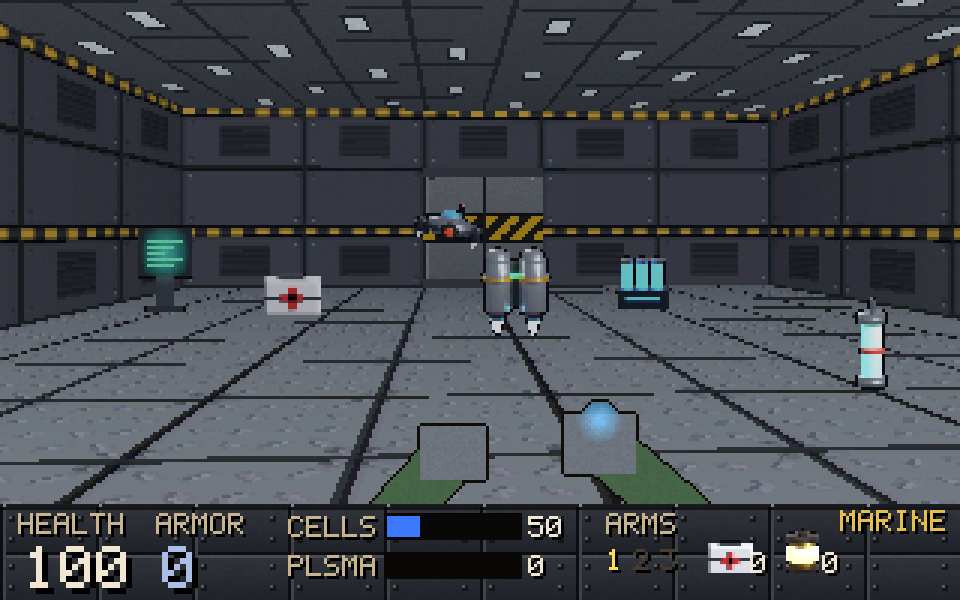
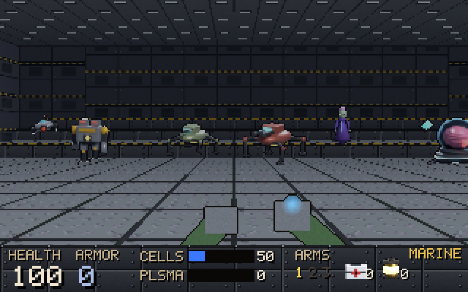
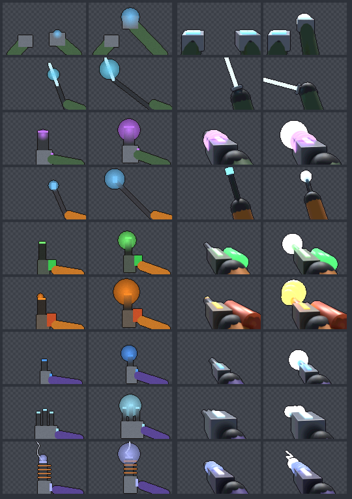
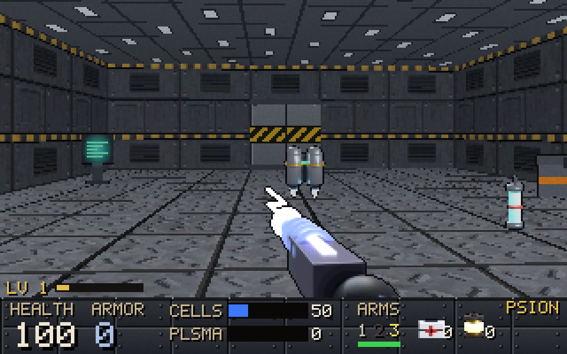

Every asset is modelled in code in `tools/blender/build_scifi_assets.py`. It's built from primitives, rendered with
Cycles at 4× size, then shrunk to 64×64 (128×80 for weapons) with a hard alpha edge, a slightly reduced colour depth and a dark outline,
so it sits in the chunky 320×200 look. The PNGs are committed under `assets/scifi/` and embedded in the game, so
players don't need Blender. Every pose of a monster is measured first and all of them are framed together, so it
keeps its size from frame to frame. To rebuild the pack (Blender 4.x, a few minutes on 4 CPU cores):

```sh
blender -b --factory-startup -noaudio -P tools/blender/build_scifi_assets.py            # everything
blender -b --factory-startup -noaudio -P tools/blender/build_scifi_assets.py -- afrit   # just matching names
blender -b --factory-startup -noaudio -P tools/blender/build_scifi_assets.py -- mage_   # the Psion's weapons
```

`--shots` writes review sheets that put the procedural art and the rendered pack side by side
(`52_rendered_sheet.png` for items and textures, `55_rendered_monsters.png` for monsters, `75_rendered_weapons.png`
for weapons). It also writes great-hall lineups of every monster in both looks (`56_…`, `57_…`) and the Psion firing
in both looks (`76_…`, `77_…`).

## Code layout

| File | Purpose |
|---|---|
| `src/Program.cs` | Raylib window, input mapping, framebuffer upload |
| `src/Game.cs` | Game state, player, classes and weapons, monster AI, projectiles, pickups, doors, portals |
| `src/Level.cs` | Map parsing, doors, rubble, collision, line of sight; the hub's ten maps and the themes |
| `src/Arena.cs` | Wave survival: wave composition, difficulty scaling, spawning, rewards, and the arena's medals |
| `src/Story.cs` | Story mode: the cases (maps, suspects, clues, patterns), questioning, the journal and accusations |
| `src/Arcade.cs` | Arcade mode: damage numbers, score and the style rank |
| `src/MapDoc.cs` | Map files (.hxm): parsing, saving, the glyphs a map can use, and the checks |
| `src/Practice.cs` | The practice courses: Velocity Hangar, Descent, Circuit and Free Roam |
| `src/Endless.cs` | The endless practice course: its seeded platforms, falling, and its board |
| `src/Discovery.cs` | Relaxed mode: relics and their placement, lore stones and text, exploration tracking |
| `src/Chests.cs` | Chest placement (never blocking paths) and loot table |
| `src/Bindings.cs` | Rebindable actions, key names, turning key state into game input |
| `src/Menu.cs` | Title, pause, options and key-binding menus; saving and loading settings |
| `src/DevConsole.cs` | `~` console, tweakable settings, cheat codes |
| `src/Entities.cs` | Things: monsters (and their stats), projectiles, pickups, decorations |
| `src/Renderer.cs` | Software raycaster, sprites, HUD, automap, menus |
| `src/Art.cs` | Procedural textures, sprites and first-person weapons (fantasy style), style switching |
| `src/SciFiArt.cs` | The sci-fi style: station textures, space skies, robots and aliens, gear and guns |
| `src/Words.cs` | Names and messages in the current style (e.g. Heresiarch → Overmind) |
| `src/Profile.cs` | Character progression: levels, skills, weapon levels, saving profile.json |
| `src/Sounds.cs` | Procedural sound effects: the fantasy and sci-fi banks, WAV export |
| `src/Music.cs` | Procedural music: a loop and a tension layer per theme in both styles, and the mixer that loops, layers and crossfades them |
| `src/GameFeel.cs` | Game feel: hit-stop, screen shake, boss intro cards, and how much of the music's tension layer to play |
| `src/GhostCodes.cs` | Ghost codes: packing a run into a line of text, and racing a friend's |
| `src/Director.cs` | The New Game+ director: ambushes when you backtrack through places you've been |
| `src/Hazards.cs` | New Game+ hazards: the Depths' crumbling floors, the Windspire's gusts and the Cisterns' floods |
| `src/Rematch.cs` | Mini-boss rematches: starting one, the clock, and each boss's board |
| `src/Codex.cs` | The monster codex: each monster's lore and how to beat it, and your kills of each |
| `src/WeaponMods.cs` | Weapon mods: the four, their chest odds, fitting them, and piercing, chain, charge and frost |
| `src/NewGamePlus.cs` | New Game+: what each tier does to the hub, and going round again |
| `src/MiniBoss.cs` | The optional maps' mini-bosses: their looks, where they wait, and their tricks |
| `src/SaveGame.cs`, `src/GameSave.cs` | Save and continue: what a save holds, capturing and restoring it, and when the game saves |
| `src/Achievements.cs` | The achievements: what each takes, its experience, and the checks that unlock them |
| `src/Gamepad.cs` | Gamepad layout: sticks, triggers and buttons turned into game input |
| `src/RenderedArt.cs` | The optional Blender-rendered art pack: embedded PNGs and which art slots they replace |
| `tools/blender/build_scifi_assets.py` | Blender script that models and renders the rendered art pack |
| `src/Audio.cs` | Plays the sounds through Raylib, from the bank matching the visual style |
| `src/Gfx.cs` | Colour helpers, drawing canvas, bitmap font, PNG writer and reader |
| `src/Headless/Headless.cs` | `--selftest` (the runner, in the order the checks run) and `--sounds` |
| `src/Headless/*Checks.cs` | The self-test's checks, a file per area: maps, gameplay, optional maps, practice, arena, progression, presentation, saving, New Game+, the endless course, game feel, weapon mods, the codex, rematches, hazards, the director, ghost codes |
| `src/Headless/Screenshots.cs` | `--shots`: the scripted screenshot tour and the art review sheets |
| `src/MapFiles.cs` | `--play` (with reload on save), `--check-map`, `--export-maps`, the HTML editor's built-in maps |
| `tools/editor/index.html` | The HTML map editor (single file); `builtin-maps.js` is generated, `test_editor.cjs` tests it |

### Map legend

Maps are ASCII grids in `src/Level.cs`:

| Glyph | Meaning | Glyph | Meaning |
|---|---|---|---|
| `#` `B` `W` `M` `I` `O` | walls (stone, brick, wood, moss, ice, marble) | `.` / `,` | indoor floor / outdoor floor (sky) |
| `D` | door | `@` | player start |
| `S` / `F` | steel-key / fire-key door | `1`–`9` | portal (links to the same digit in another map) |
| `P` | portcullis (opened by a lever) | `E` | exit (sealed until the boss dies) |
| `L` | lever (gates open once every lever is pulled and every plate covered) | `e` `a` `c` `C` `d` `H` | Ettin, Afrit, Centaur, Slaughtaur, Dark Bishop, Heresiarch |
| `h` `q` `u` | Crystal Vial, Quartz Flask, Mystic Urn | `b` `g` | blue / green mana |
| `k` / `f` | Steel Key / Fire Key | `r` | Mesh Armor |
| `$` | treasure chest (hand-placed; most are scattered randomly) | `J` | jetpack / Wings of Wrath |
| `X` | pushable stone block | `^` | pressure plate |
| `K` | rubble (break it with attacks or Use) | `V` | wrecked ship (Use to repair with ore, then to fly home) |
| `N` `Q` `U` | ore veins: iron, moonstone, brimstone (break like rubble; the ore goes in your pack) | `A` | asteroid (flight maps) |
| `Z` | secret wall (looks like its neighbours) | `&` | lore stone |
| `%` | secret treasure (a relic in Relaxed, a Mystic Urn in Classic) | | |
| `*` | arena spawn rune | `!` | arena altar (starts the waves) |
| `+` | checkpoint pad (its whole ledge counts; respawn here) | `=` | lift pad (back to your highest checkpoint) |
| `w` `x` | weapon piece for slot 2 / slot 3 | `t` `p` `T` | torch, pillar, tree |
