# Hexen Sharp

A small Hexen-style first-person dungeon crawler written in C#. It's built to run on cheap PCs: everything is
software-rendered into a 320×200 framebuffer, and all textures, sprites and sounds are generated in code.
There are no asset files.

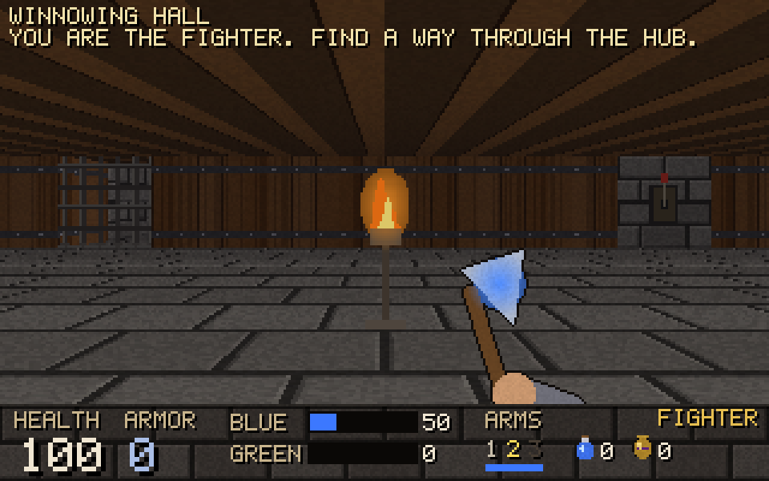
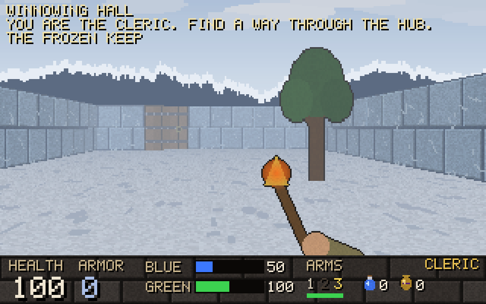
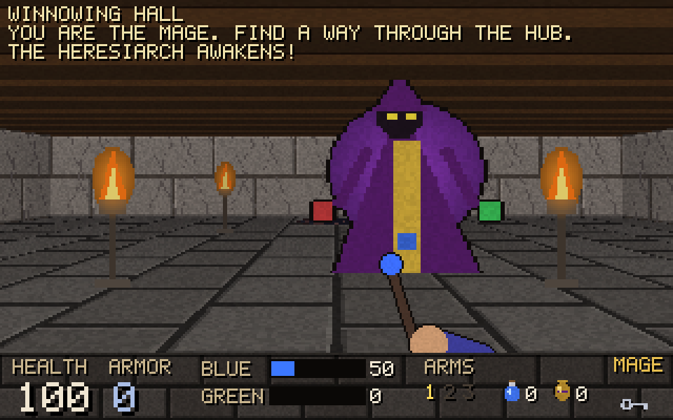
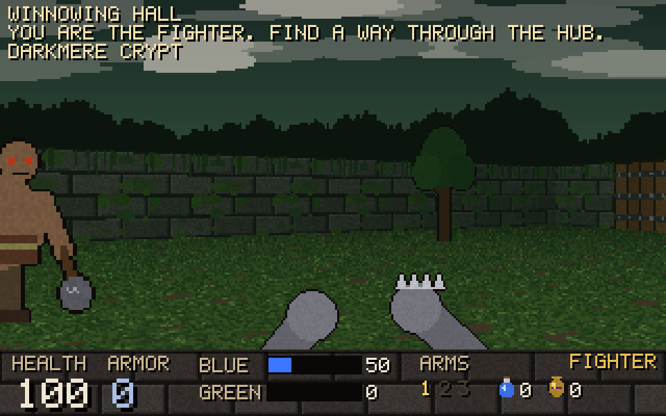
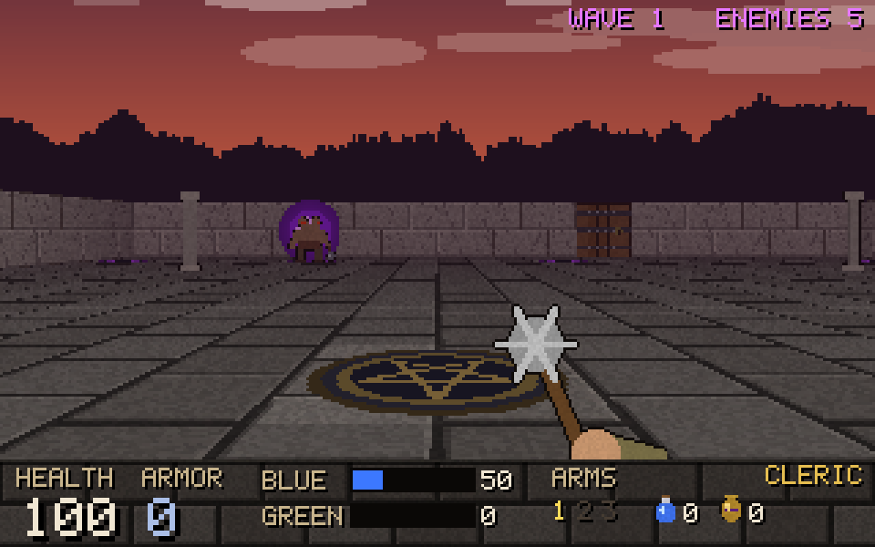
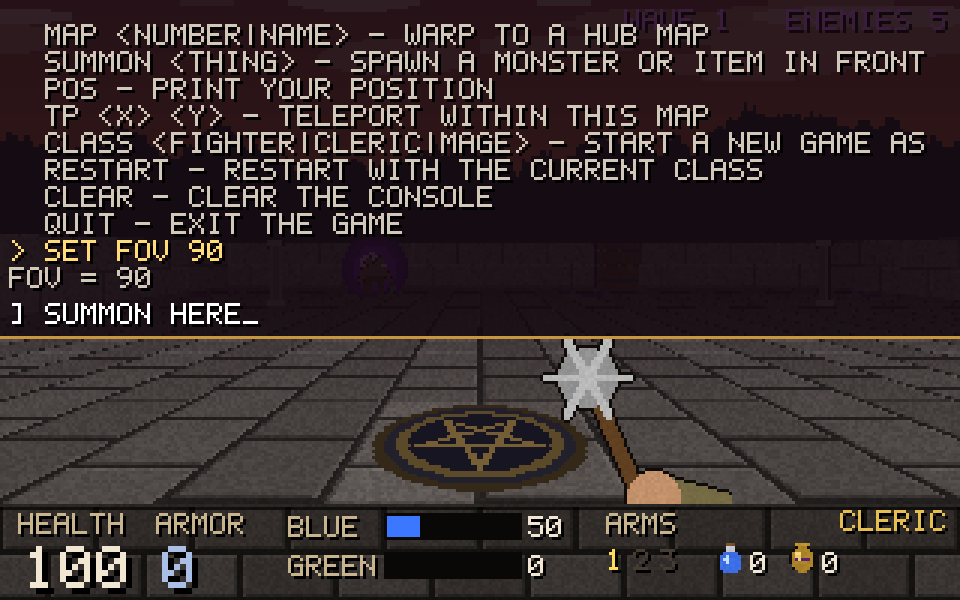
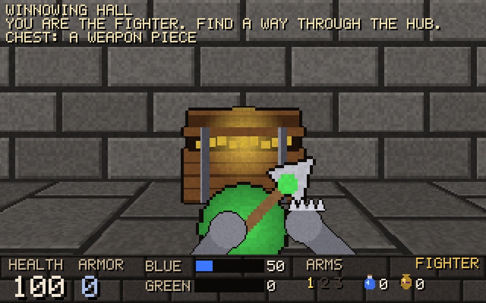
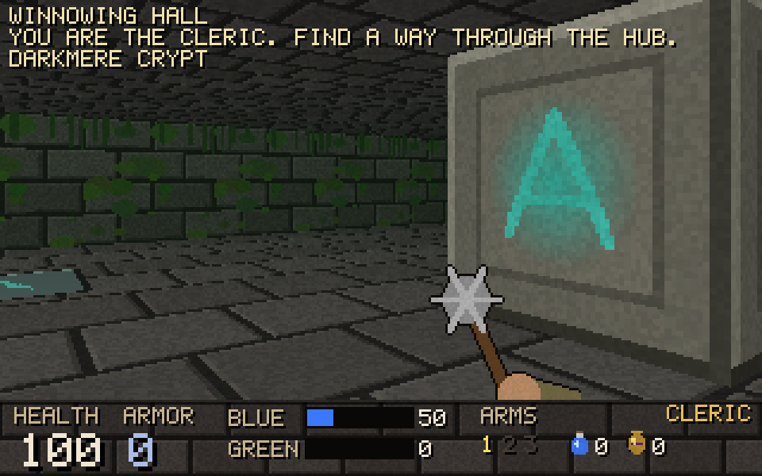
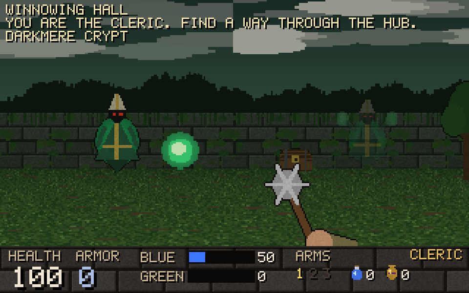
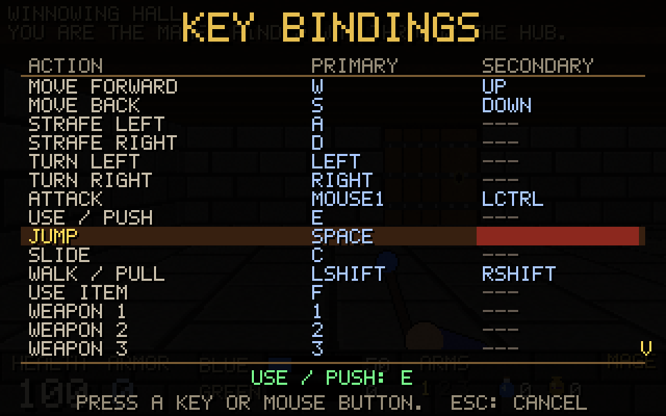
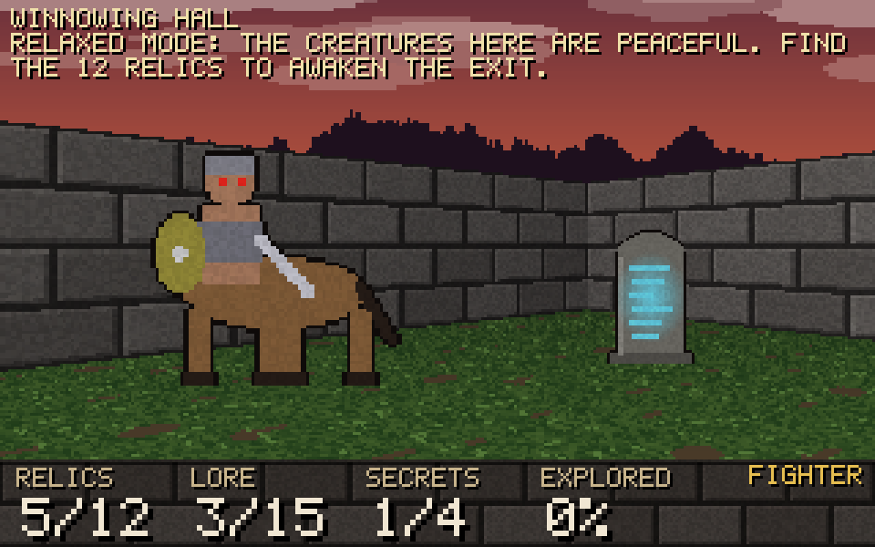
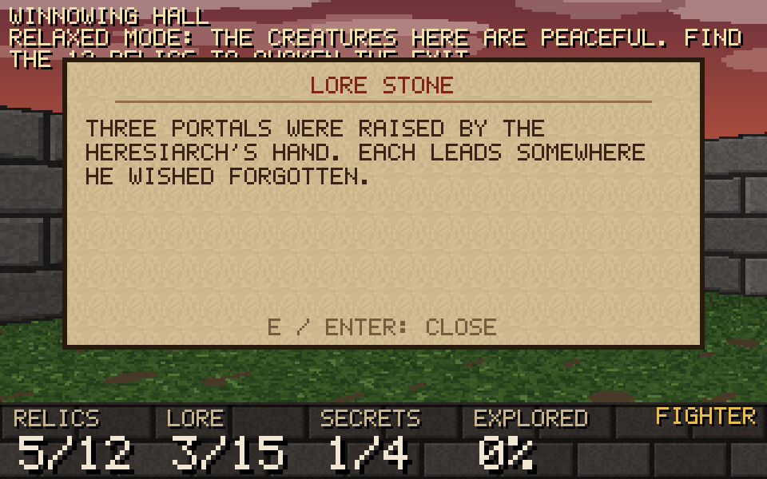
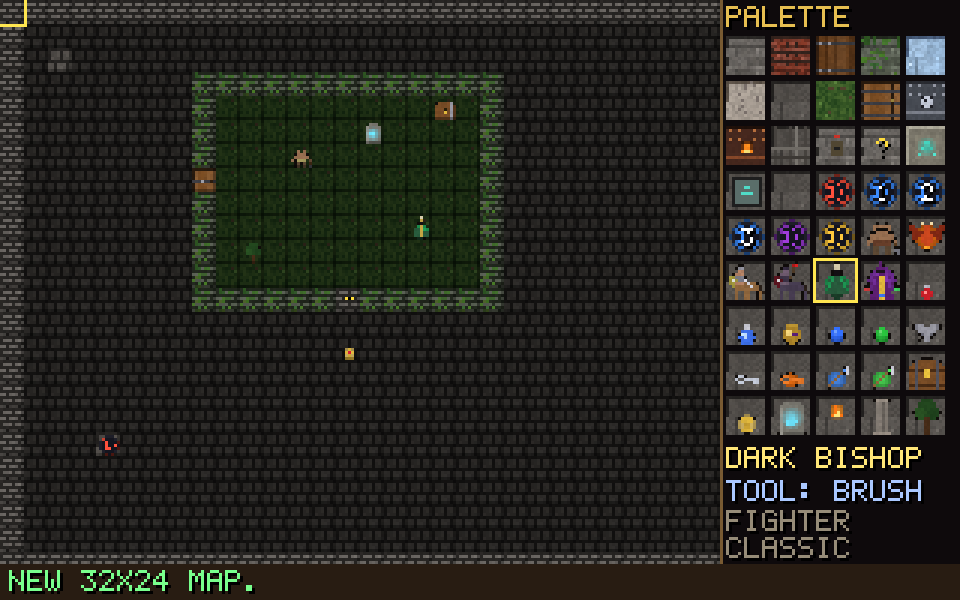

## Features

- **Two play styles**, chosen when you start a new game:
  - **Classic:** fight through the hub, solve its puzzles and slay the Heresiarch.
  - **Relaxed:** no combat. Creatures wander peacefully and shy away if you get close, your weapon stays
    sheathed, and you can't die. Instead you explore: find the **12 relics** hidden across the hub (placed
    differently every game, favouring dead ends and far corners), read **lore stones**, and uncover **secret
    passages**. The HUD tracks relics, lore, secrets and how much of the hub you've explored. Finding every
    relic awakens the exit portal. Keys, levers, block puzzles and chests all still work; chests are never
    traps and the arena stays quiet.

- **Three classes**, each with their own three weapons, like Hexen:
  | Class | 1 (no mana) | 2 (blue mana) | 3 (green mana) |
  |---|---|---|---|
  | Fighter | Spiked Gauntlets | Timon's Axe | Hammer of Retribution |
  | Cleric | Mace of Contrition | Serpent Staff | Firestorm |
  | Mage | Sapphire Wand | Frost Shards | Arc of Death |
- **Blue and green mana.** The Fighter's axe still works without mana, just weaker.
- **Hub levels.** Portals connect *Winnowing Hall*, *The Frozen Keep*, *Darkmere Crypt* and the optional
  *Chaos Arena*. Each map keeps its state (dead monsters, opened doors, pulled levers) when you leave and come back.
- **Puzzles.** Levers raise portcullises, the Fire Key and Steel Key open locked doors in other maps, and the
  exit stays sealed until the Heresiarch is dead. **Pushable stone blocks** go onto **pressure plates**: `E`
  pushes a block one cell, `Shift+E` pulls it toward you, so a block can never get permanently stuck. A map's
  gates open once all its levers are pulled *and* all its plates are covered. Lift a block off a plate and the
  gate drops again.
- **Chaos Arena waves.** Step on the golden altar to start endless waves. Each wave has more monsters and
  tougher types (Afrits from wave 2, Centaurs from 3, Slaughtaurs from 5). Monster health, damage and speed
  scale up every wave, and every fifth wave adds Heresiarchs. Supplies appear at the altar after each wave.
- **Secrets and lore (both styles):** each map hides a secret passage behind a wall that looks like any
  other; press `E` on it to slide it open. 15 lore stones tell the story of the hub; press `E` to read one.
- **Treasure chests** are scattered randomly through every map each new game. Open one with `E`: it spills
  1–3 random items (health, mana, armor, flasks, rarely an urn or a weapon piece you're missing). Watch out,
  roughly one in eight is a trap and a monster bursts out. Seen chests show on the automap, and the victory
  screen tallies how many you opened.
- **Jumping and sliding.** Jump over low missiles and melee swings; slide for a burst of speed and to duck
  under missiles.
- **Level editor** (title menu → Level editor): paint your own maps with the mouse using every wall,
  door, puzzle piece, monster and item in the game, then play-test instantly. Maps save as small text files.
- **Options menu** (from the title screen or `Esc` in game): rebind every control, set mouse sensitivity,
  invert mouse, field of view and FPS display. Settings are saved between sessions.
- **Developer console (`~`)** for changing game mechanics, plus Hexen's classic cheat codes.
- **Monsters:** Ettins, Afrits (flying fire gargoyles), Centaurs, Slaughtaurs, **Dark Bishops** and the Heresiarch boss.
  Dark Bishops float, fire pairs of **homing missiles**, and **blur**: they turn see-through and dart sideways,
  and attacks pass straight through them while they do. Homing missiles skim low and stop steering at the last
  moment, so a well-timed jump lets them fly underneath.
  Monsters wake on sight or on noise, open doors, and use melee and/or missiles.
- **Inventory:** Quartz Flasks and Mystic Urns, used with `F`.
- **Renderer:** grid raycaster with textured floors and ceilings, outdoor sky areas, distance fog (black in
  the hall, white in the Frozen Keep), rising doors, see-through portcullises, mouse look up/down,
  depth-buffered sprites, an automap and screen flashes.
- Synthesized sound effects played through Raylib.

## Running

Requires the [.NET 8 SDK](https://dotnet.microsoft.com/download). Windowing, input and audio come from
[Raylib-cs](https://github.com/ChrisDill/Raylib-cs), which NuGet fetches with native binaries for
Windows, Linux and macOS.

```sh
dotnet run -c Release
```

## Controls

These are the defaults. Change any of them in **Options → Key bindings** (see below).

| Key | Action |
|---|---|
| `W` `A` `S` `D` / arrow keys | Move / strafe / turn |
| Mouse | Look (including up/down) |
| Left click / `Ctrl` | Attack |
| `E` | Use (doors, levers, chests, lore stones, secret walls); push a stone block |
| `Shift+E` | Pull a stone block toward you |
| `Space` | Jump |
| `C` | Slide (while moving) |
| `1` `2` `3` / mouse wheel | Select weapon |
| `F` | Use a healing item (Quartz Flask, else Mystic Urn) |
| `Shift` | Walk |
| `Tab` / `M` | Automap |
| `Esc` | Pause menu (Resume, Options, Restart, Quit) |
| `F12` | Save a screenshot |
| `~` | Developer console |

## Walkthrough (spoilers)

1. In Winnowing Hall, grab the class weapon piece in the north-east room.
2. Pull the lever on the great hall's south wall. The portcullis opens to the courtyard.
3. Step on blue portal **1** to reach the Frozen Keep and grab its weapon piece (middle room).
   The east room is behind a fire door.
4. Take portal **2** (the Keep's west room) to Darkmere Crypt. Pull *both* levers (north-east and south-west rooms)
   and push the two stone blocks in the south-east room onto its two pressure plates to raise the gate to the
   **Fire Key**. (Push each block north twice, then out to the plate on its side.)
5. Back in the Keep, open the fire door, pull the lever on the east wall, and take the **Steel Key** from the vault.
6. Return to Winnowing Hall and open the steel door off the courtyard. Kill the Heresiarch, then step on the red
   exit rune.

Optional: portal **3** in the courtyard leads to the Chaos Arena for wave survival (Dark Bishops join from wave 4).

**Relaxed mode:** the route is the same, but instead of killing the Heresiarch you need all 12 relics, which
are spread over all four maps (including the arena) before the exit rune wakes. Secret walls sit in the wall
between Winnowing Hall's great hall and courtyard (open it from the courtyard side), under the Keep's west room,
under the crypt's south-west room, and under the arena's antechamber.

## Level editor

Pick **Level editor** on the title menu (or type `edit` in the console). The map is on the left and the palette
of everything you can place is on the right, drawn with the game's own textures and sprites.

| Input | Action |
|---|---|
| Left click (drag) | Paint the selected piece |
| Right click | Erase to floor |
| Middle click / `Q` | Pick up the piece under the cursor |
| Mouse wheel / `[` `]`, or click the palette | Choose a piece |
| Arrows / `WASD`, `Space`, `Delete` | Move the cursor, paint, erase (no mouse needed) |
| `F` | Toggle the fill tool (flood-fills the area you click) |
| `-` / `=` | Zoom out / in |
| `T` | Cycle theme (hall, ice, crypt, arena) |
| `R` | Rename the map |
| `Ctrl+Z` / `Ctrl+Y` | Undo / redo |
| `Ctrl+S` | Save |
| `Ctrl+O` | Open a saved map, or one of the built-in maps as a template |
| `Ctrl+N` | New map (press again to cycle 32×24, 48×32 and 20×16) |
| `P` / `F5` | Play-test the map (`C` picks the class, `V` switches Classic/Relaxed) |
| `H` | Show / hide help |
| `Esc` | Leave (asks again if there are unsaved changes) |

A play-test needs a player start (`@`); the editor warns about a missing or unreachable exit and anything
that can't be reached. While testing, **Esc → Back to editor** returns to your map, and so does winning.
A custom map without a Heresiarch has its exit open from the start. Portal digits only link maps in the
built-in hub.

Maps are saved as `.hxm` text files in the `maps` folder next to `settings.cfg`
(`~/.config/HexenSharp/maps/` on Linux, `%APPDATA%\HexenSharp\maps\` on Windows): a `name:` and `theme:`
header, a `---` line, then the rows using the map legend below, so you can also edit them by hand.
The console command `playmap <name>` plays a saved map directly.

## Options and key bindings

Open **Options** from the title menu, or press `Esc` in game and pick Options.

- **Key bindings:** every action has a primary and a secondary key; keyboard keys, mouse buttons and the
  mouse wheel all work. Select a slot and press `Enter`, then press the new key (`Esc` cancels). `Backspace`
  clears a slot, `Left`/`Right` switch between slots, and **Reset to defaults** restores everything.
  Binding a key that's already in use moves it off the other action and tells you which.
- **Mouse sensitivity**, **Invert mouse**, **Field of view** and **Show FPS**: change with `Left`/`Right` or `Enter`.
- `Esc`, `Enter` and the arrow keys always work in menus, and `Esc` can't be bound, so a bad binding can
  never lock you out.

Settings are saved when you leave the Options menu and when you quit, to `settings.cfg` in your user
config folder (`~/.config/HexenSharp/` on Linux, `%APPDATA%\HexenSharp\` on Windows,
`~/Library/Application Support/HexenSharp/` on macOS). The file is just console commands, so you can edit it
by hand.

## Console and cheats

Press `~` to open the console (the game pauses). `Tab` completes names, `Up`/`Down` recall history,
`PgUp`/`PgDn` scroll, `Esc` closes. Type `help` for everything; the most useful commands:

| Command | Effect |
|---|---|
| `vars` | list every tweakable setting and its current value |
| `bind [action] [key] [key2]` | show or change key bindings, e.g. `bind jump space mouse2` |
| `unbind <action>`, `binddefaults` | clear an action's keys / restore every default |
| `set <var> <value>` (or just `<var> <value>`) | change a setting, e.g. `speed 1.5`, `fov 90`, `gravity 6` |
| `reset` | restore default settings |
| `god`, `noclip`, `notarget`, `freeze` | toggles |
| `give all\|health\|mana\|weapons\|keys\|items\|armor` | give yourself things |
| `summon <ettin\|afrit\|centaur\|slaughtaur\|bishop\|heresiarch\|flask\|...>` | spawn something in front of you |
| `map <number\|name>` | warp to a hub map (`map 4` = Chaos Arena) |
| `chests` | list this map's chests and how many you've opened |
| `seed <n\|random>` | fix the chest layout (applies on `restart`) |
| `mode <classic\|relaxed>` | start a new game in a play style |
| `edit`, `playmap <name>` | open the level editor / play a saved custom map |
| `kill`, `reveal`, `pos`, `tp x y`, `class <name>`, `restart`, `quit` | misc |

Settings: `speed`, `sens`, `invertmouse`, `damage`, `monsterdamage`, `monsterspeed`, `firerate`, `manacost`, `fog`, `fov`,
`gravity`, `jump`, `slidespeed`, `chests` (per 200 floor cells, next game), `god`, `noclip`, `notarget`, `freeze`, `infinitemana`, `fullbright`, `showfps`.

Hexen's cheat codes work when typed during play (or in the console):
`satan` (god), `casper` (noclip), `nra` (all weapons & mana), `indiana` (items), `locksmith` (keys),
`clubmed` (health), `butcher` (kill all), `mapsco` (reveal map), `visitN` (warp to hub map N).

## Developer tools

```sh
dotnet run -c Release -- --selftest       # validates maps (reachability) and runs scripted gameplay checks
dotnet run -c Release -- --shots shots    # renders scripted screenshots headlessly into ./shots
```

## Code layout

| File | Purpose |
|---|---|
| `src/Program.cs` | Raylib window, input mapping, framebuffer upload |
| `src/Game.cs` | Game state, player, classes and weapons, monster AI, projectiles, pickups, doors, portals |
| `src/Level.cs` | Map parsing, doors, collision, line of sight; the hub's four maps and the themes |
| `src/Arena.cs` | Wave survival: wave composition, difficulty scaling, spawning, rewards |
| `src/Editor.cs` | Level editor: map document and file format, palette, tools, undo, validation, play-testing |
| `src/Discovery.cs` | Relaxed mode: relics and their placement, lore stones and text, exploration tracking |
| `src/Chests.cs` | Chest placement (never blocking paths) and loot table |
| `src/Bindings.cs` | Rebindable actions, key names, turning key state into game input |
| `src/Menu.cs` | Title, pause, options and key-binding menus; saving and loading settings |
| `src/DevConsole.cs` | `~` console, tweakable settings, cheat codes |
| `src/Entities.cs` | Things: monsters (and their stats), projectiles, pickups, decorations |
| `src/Renderer.cs` | Software raycaster, sprites, HUD, automap, menus |
| `src/Art.cs` | Procedural textures, sprites and first-person weapons |
| `src/Audio.cs` | Procedural sound effects |
| `src/Gfx.cs` | Colour helpers, drawing canvas, bitmap font, PNG writer |
| `src/Headless.cs` | `--selftest` and `--shots` |

### Map legend

Maps are ASCII grids in `src/Level.cs`:

| Glyph | Meaning | Glyph | Meaning |
|---|---|---|---|
| `#` `B` `W` `M` `I` `O` | walls (stone, brick, wood, moss, ice, marble) | `.` / `,` | indoor floor / outdoor floor (sky) |
| `D` | door | `@` | player start |
| `S` / `F` | steel-key / fire-key door | `1`–`9` | portal (links to the same digit in another map) |
| `P` | portcullis (opened by a lever) | `E` | exit (sealed until the boss dies) |
| `L` | lever (gates open once every lever is pulled and every plate covered) | `e` `a` `c` `C` `d` `H` | Ettin, Afrit, Centaur, Slaughtaur, Dark Bishop, Heresiarch |
| `h` `q` `u` | Crystal Vial, Quartz Flask, Mystic Urn | `b` `g` | blue / green mana |
| `k` / `f` | Steel Key / Fire Key | `r` | Mesh Armor |
| `$` | treasure chest (hand-placed; most are scattered randomly) | | |
| `X` | pushable stone block | `^` | pressure plate |
| `Z` | secret wall (looks like its neighbours) | `&` | lore stone |
| `%` | secret treasure (a relic in Relaxed, a Mystic Urn in Classic) | | |
| `*` | arena spawn rune | `!` | arena altar (starts the waves) |
| `w` `x` | weapon piece for slot 2 / slot 3 | `t` `p` `T` | torch, pillar, tree |
